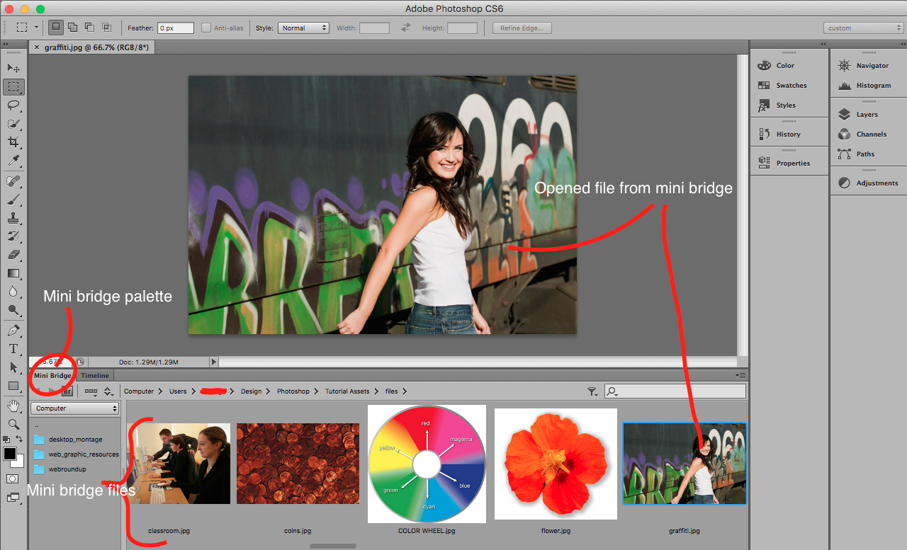

## About Lesson 4

### Brief
In this lesson, I learnt about working with Mini Bridge where the I would be able to launch/open files and folders the same way as the main Bridge application.

### Illustration

### Online Course
Visit [IACT](https://iact.ie) for the course
