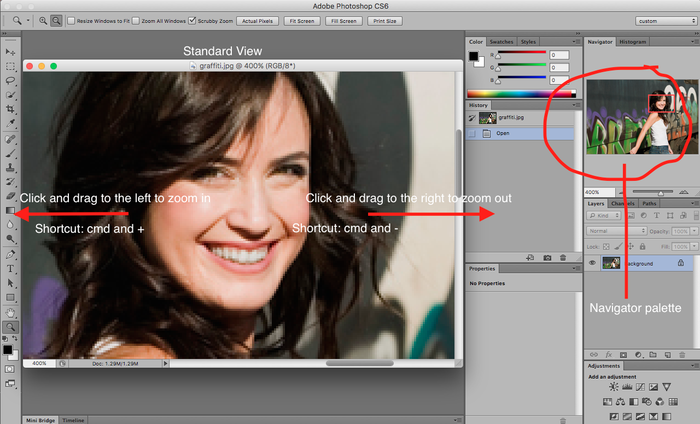

## About Lesson 5

### Brief
In this lesson, I learnt how to toggle between the different views such as the standard view, docked view, full screen view with bars and without bars.
Also worked with the navigator palette to navigate around an image and perform some of the zooming actions as illustrated below.
Commands to use while zooming:
- Zooming in: ```cmd/ctrl and +```
- Zooming out: ```cmd/ctrl and -```
- Default zoom: ```cmd/ctrl and 0```

### Illustration


### Online Course
Visit [IACT](https://iact.ie) for the course
