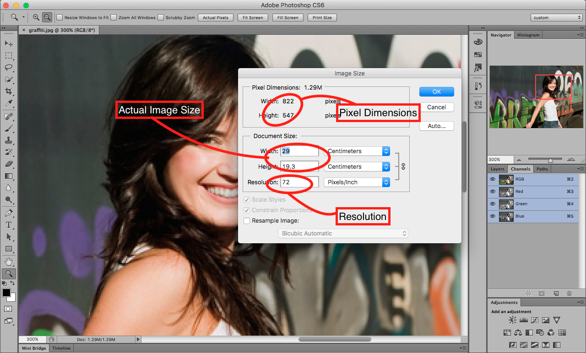

## About Lesson 7

### Brief
In this lesson, I learnt about manipulating the image size and resolution for screen based and print based image editing. Some of the things to consider are:

- Document Size(Image size) which are the actual dimensions of the image measured as cm/inches in width x height.
- Pixel dimensions which are measured as actual pixels in width x height.
- Resolution which is measured as actual pixels per inch of the image.

### Illustration for Screen Based resolution


Accessed under the menus: ```File > Save for Web and Devices```. Here what matters most is the pixel dimensions. These dimensions usually determine how much real estate
the image will occupy on our browsers or screens.

### Illustration for Print Based resolution


Accessed under the menus: ```Image > Image Size```. One thing to note about here is that the resolution always needs to be edited to a higher
value so as to prevent pixelation of the image. To do this uncheck the ```Resample Image``` checkbox. Now you can proceed to add a high value of the Resolution.
You will notice a change of the document size that is needed for the resolution value entered.

### Online Course
Visit [IACT](https://iact.ie) for the course
