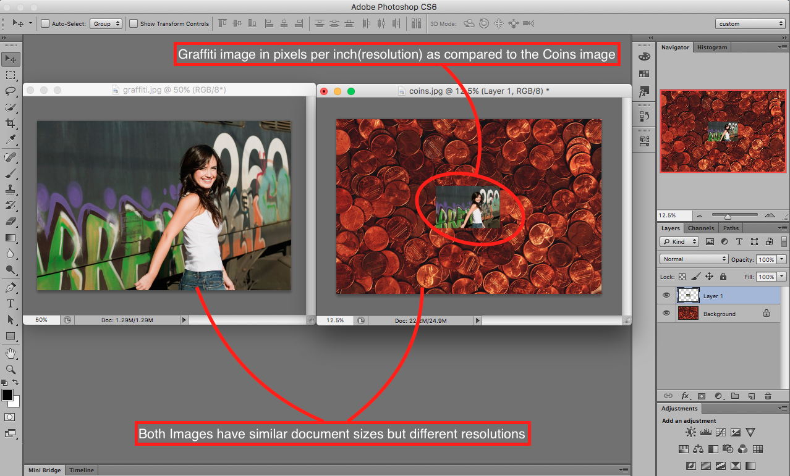

## About Lesson 8

### Brief
In this lesson, I learnt about the difference between an image's document size(image size) and resolution. Images may have the same document size in terms of dimensions but will differ in resolution.

- Document Size(Image size) is usually expressed as width x height in cm/inches of a document if the image were to be printed on paper.
- Resolution is usually the measure of the number of pixels there are per inch on the image.

For further reading visit [this article.](https://www.photoshopessentials.com/essentials/image-resolution)

### Illustration
In the illustration below we get to see how the two images have the same image size but have completely different resolutions. When put together, the image on the left becomes a little obscured by the image of coins.

### Online Course
Visit [IACT](https://iact.ie) for the course
