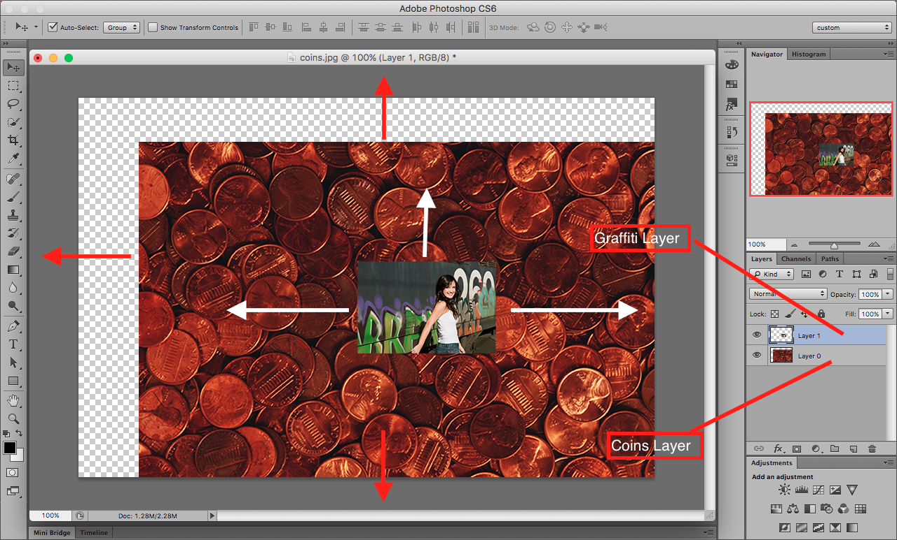

## About Lesson 10

### Brief
In this lesson, I learnt about moving around and arranging layers within an image. Using the move tool we can select and move specific layers to desired positions and be able to also modify how the layers are arranged.

- Moving would involve selecting and dragging the desired layer to the desired position
- Arranging would involve selecting the layer from the layers palette and holding and dragging to the desired priority position. This would determine which layer goes on top of the other

### Illustration

### Online Course
Visit [IACT](https://iact.ie) for the course
