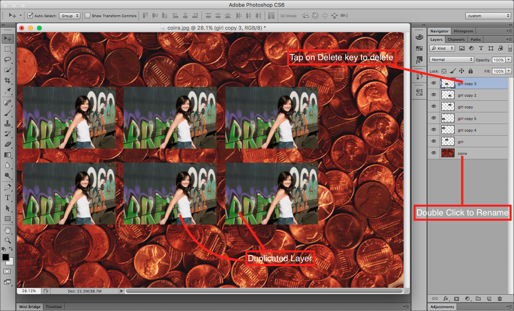

## About Lesson 11

### Brief
In this lesson, I learnt about naming my layers for easier tracking during editing, duplicating my layers and deleting them when I don't need them.

- To name a layer, one double clicks on the layer name and enters the desired name
- While duplicating a layer, one simply holds down on the alt/option key and while using the move tool, drags the image to any direction. Another way is to right click on the layer in the layers palette and click on ```Duplicate Layer...``` in the menu options provided.
- Deleting a layer is simple which you can do by first selecting the layer and taping on the backspace or delete key. You may also right click on the layer and click on ```Delete Layer```

### Illustration


### Online Course
Visit [IACT](https://iact.ie) for the course
