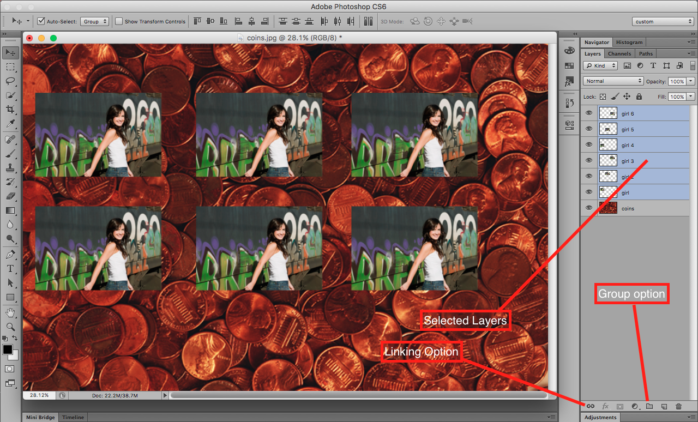

## About Lesson 11

### Brief
In this lesson, I learnt about linking and grouping layers which would allow as to move and select multiple layers at one go. To link or group layers, one must first select the layers that are to be edited together.

- Linking layers involves selecting the layers as illustrated below and clicking on the link option. We are then able to move them around together, however, they can still be edited individually.
- To group layer, one would hold and drag the selected layers to the group option which will group them into a nameable folder. This allows us to manipulate the layers together as a group.

### Illustration

### Online Course
Visit [IACT](https://iact.ie) for the course
