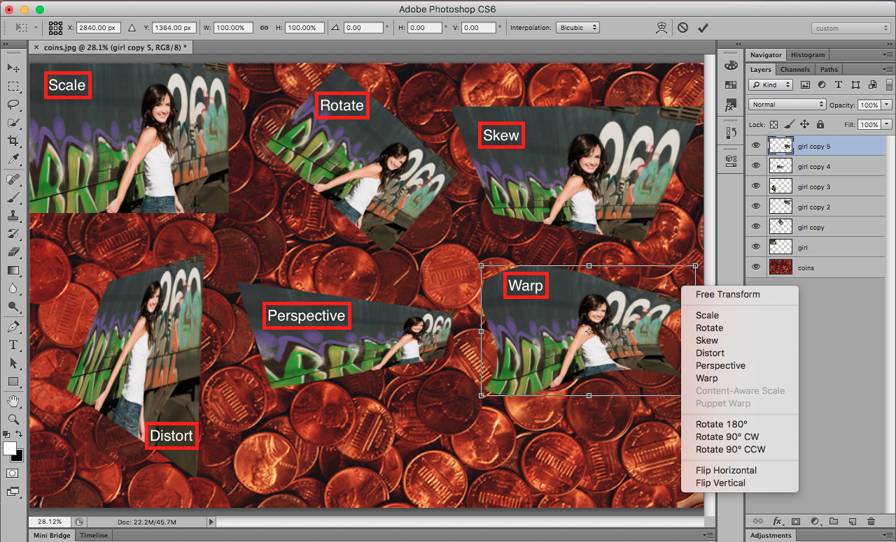

## About Lesson 14

### Brief
In this lesson, I learnt about the various transformations available on Photoshop. They include:

- Scale.
- Rotate.
- Skew.
- Distort.
- Perspective.
- Warp.
- Free Transform.
- Rotate 180 degrees.
- Rotate 90 degrees clockwise.
- Rotate 90 degrees counter clockwise.
- Flip Horizontal.
- Flip Vertical.

### Illustration
In this illustration I applied some of the various transformations to the 'girl' layers

### Online Course
Visit [IACT](https://iact.ie) for the course
