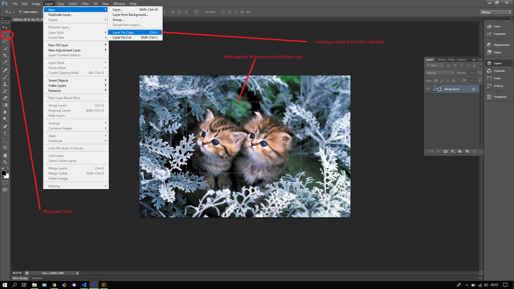

## About Lesson 15

### Brief
In this lesson, I learnt about the rectangular marque tool which is used for selections in photoshop. In photoshop, once a selection is made any image adjustments will only affect the selected section of the image. There are 4 types of marque tools in photoshop:

- Rectangular marque tool
- Eliptical marque tool
- Single row marque tool
- Single column marque tool

### Illustrations
In this illustration I was able to select the heads of the kittens with the marque tool inorder to create a layer from the selection

Here the layer has been created and we can apply transformations to the layer as illustrated below where I scaled the size of the layer

### Online Course
Visit [IACT](https://iact.ie) for the course