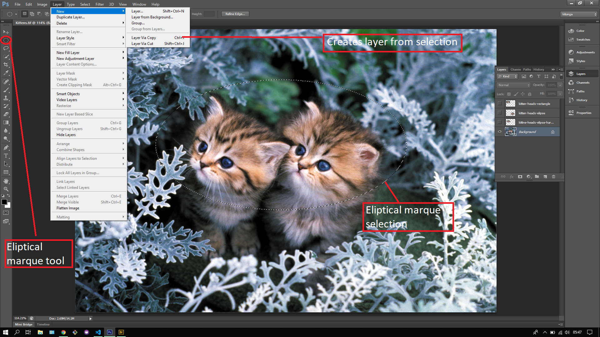
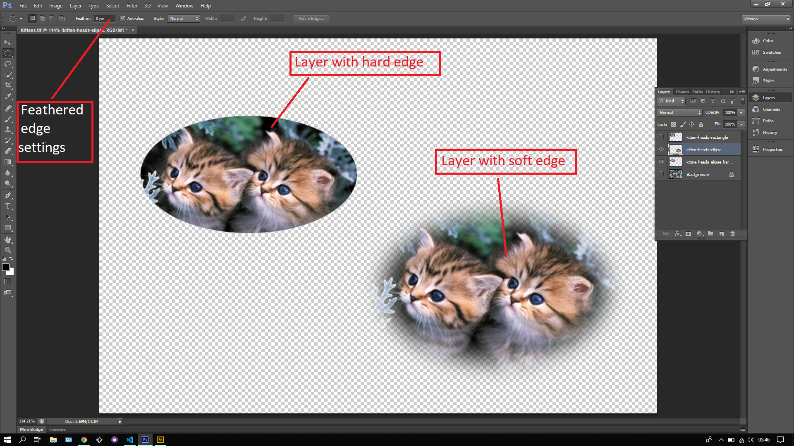

## About Lesson 16

### Brief
In this lesson, I learnt about the eliptical marque tool which is used for selections in photoshop as well. Here the actions were similar to the previous lesson where we would create a layer from the selection in the image as illustated below.

### Illustrations
In this illustration I was able to select the heads of the kittens with the marque tool inorder to create a layer from the selection.

Here the layer has been created and we can apply transformations to the layer as illustrated below where I scaled the size of the layer. I also created a layer with a soft edge that has a feather setting applied.

### Online Course
Visit [IACT](https://iact.ie) for the course