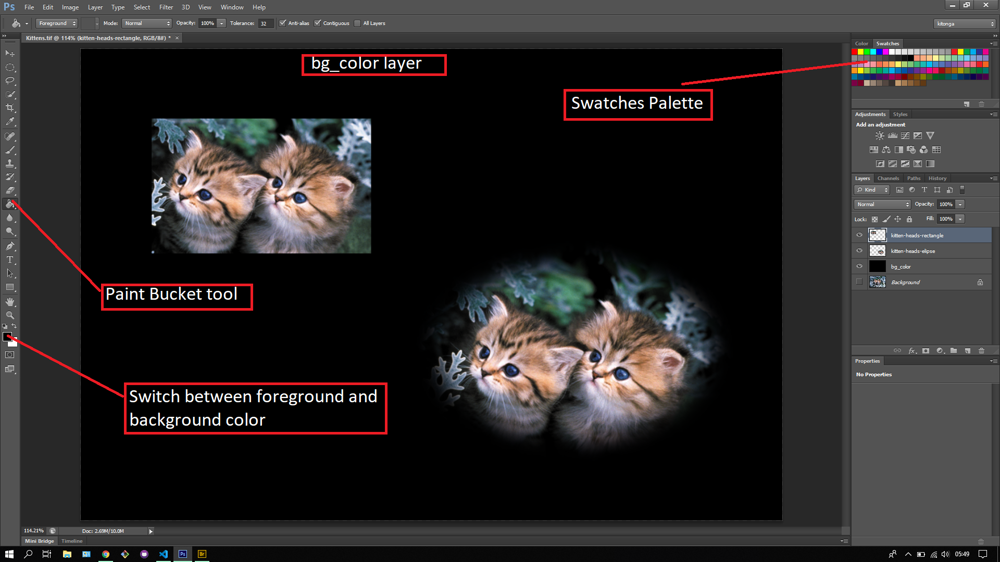

## About Lesson 17

### Brief
In this lesson, I learnt about the Paint bucket tool and how it uses the swatches palette to pick a color and apply it on any selected layer as a foreground or background.

### Illustration
In this illustration I created a new layer and named it 'bg_color' where I used the Paint bucket tool to apply a foreground color from the swatches palette. You can switch between the foreground and background using the tool at the bottom right corner as illustrated.

### Online Course
Visit [IACT](https://iact.ie) for the course