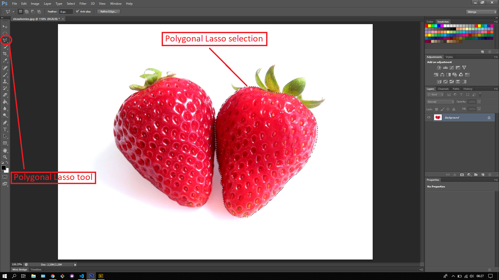
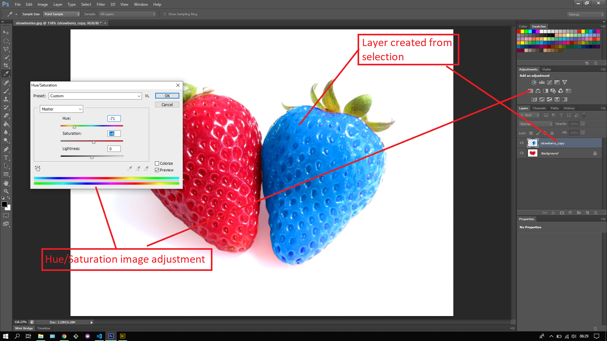

## About Lesson 18

### Brief
In this lesson, I learnt about using the Lasso tool where I was able to select a section of the image using the Polygonal Lasso. Lassos are used to get precise selections of an image in photoshop. There are three types of Lassos in Photoshop namely:

- Lasso Tool
- Polygonal Lasso Tool
- Magnetic Lasso Tool

### Illustrations
In this illustration I used the Polygonal Lasso to select and plot around the strawberry.

Here I created a new layer via copy(ctrl + J) and applied an image adjustment called Hue/Saturation(found under menu Image > Adjustments > Hue/Saturation)

### Online Course
Visit [IACT](https://iact.ie) for the course