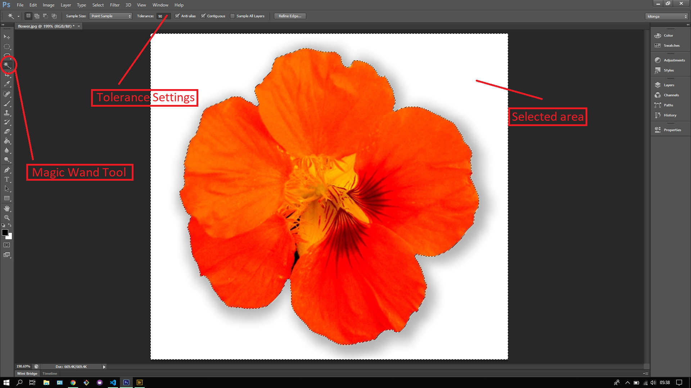
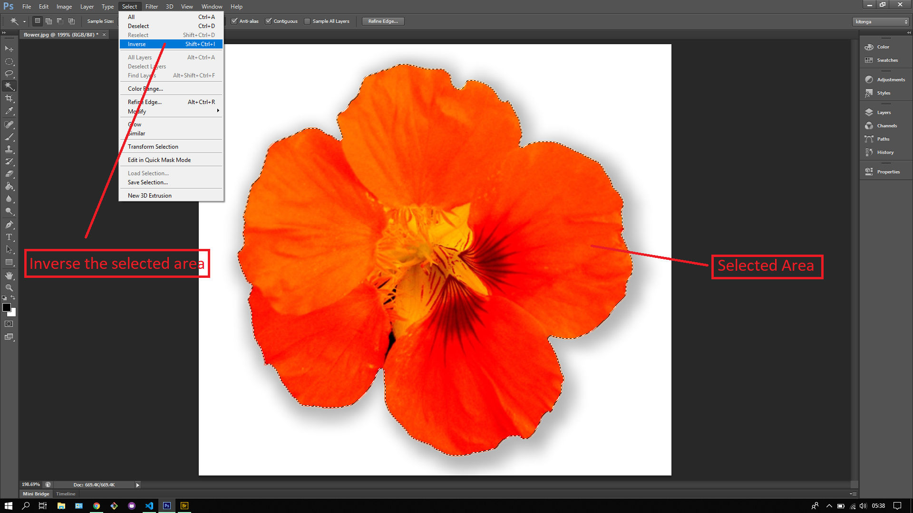

## About Lesson 19

### Brief
In this lesson, I learnt about using the Magic Wand Tool which can be used to select a section of a picture depending on the tolerance settings. The tolerance settings control how much is selected by identifying pixels of the same shade of color. The higher the tolerance the more accurate the selection.

### Illustrations
Here I selected the white space area with the tolerance setting set to 90 for accurate selection of only white space.

Here I inversed (Select > Inverse) the selection as illustrated so as to select the flower and created a new layer via copy(ctrl + J)

### Online Course
Visit [IACT](https://iact.ie) for the course