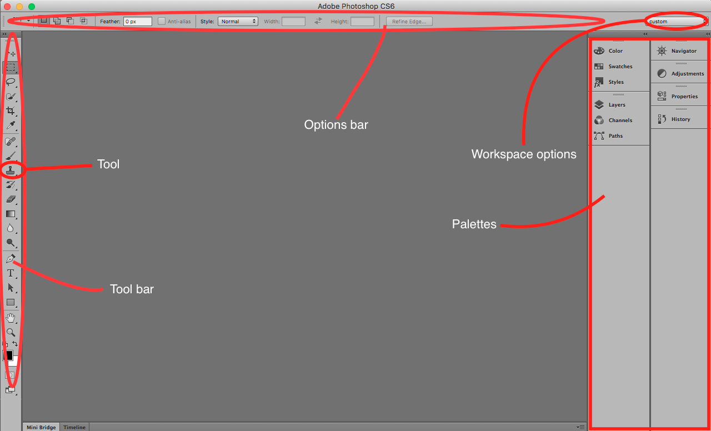

## About Lesson 2

### Brief
In this lesson, I learnt about the layout of Photoshop CS6 where the default workspace is the ```Essential``` workspace.
The layout consists of:
- The ```Tool Bar``` which resides on the left of the workspace pane. This is where all the tools for manipulating PSDs are located.
- The ```Options Bar``` which is at the top of the workspace. This is where the options for the selected tool on the tool bar are listed.
- The ```Palettes``` at the right of the pane. This pane has some of the available palettes that one would use to manipulate color, layers, mini bridge e.t.c.

### Illustration


### Online Course
Visit [IACT](https://iact.ie) for the course
