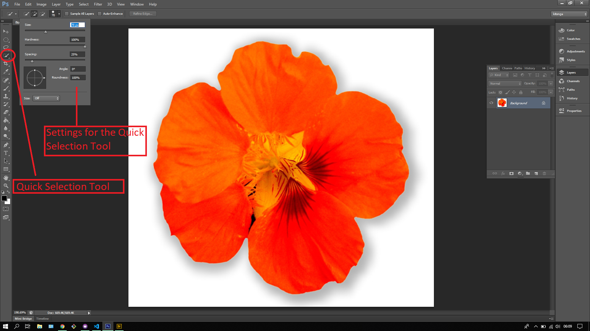
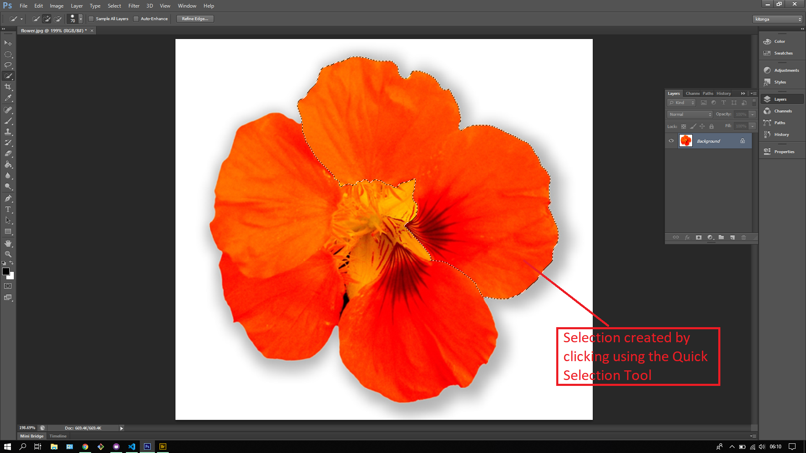
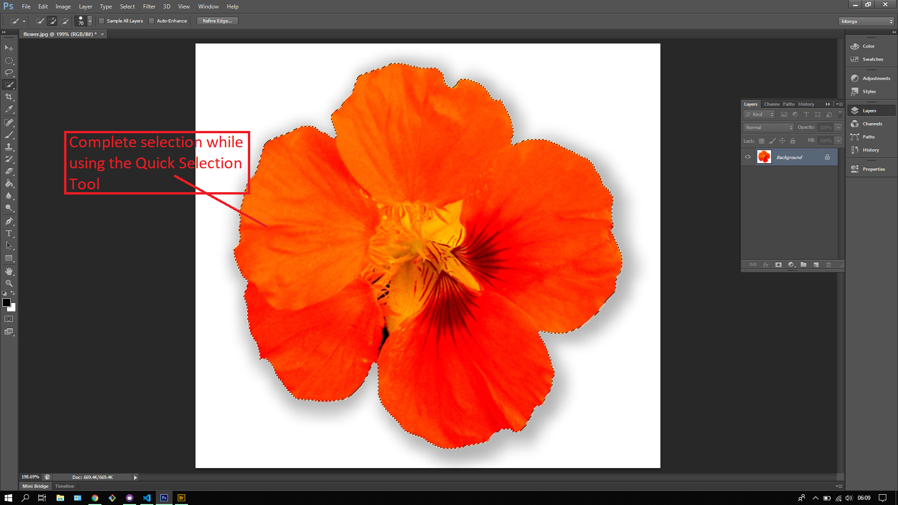

## About Lesson 20

### Brief
In this lesson, I learnt about using the Quick Selection Tool which works the same way as the Magic Wand Tool where pixels of the same shade of color would be selected. However this tool can only be used when the edges of the desired selection area are clearly defined in terms of shade of color. For instance, in the images illustrated the difference in color between the white space and the flower makes it easier to select the flower.

### Illustrations
Here I tweaked the size and hardness of the brush for the quick selection tool.

Here I selected the flower selection by clicking multiple areas of the flower to get the complete selection.

This is the complete selection.

### Online Course
Visit [IACT](https://iact.ie) for the course