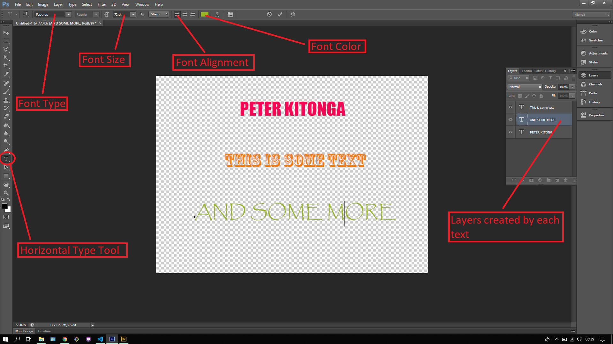

## About Lesson 21

### Brief
In this lesson, I learnt about using the Type Tool which one would use to add text to an image. There are 4 types of Type Tools namely:
- Horizontal Type Tool
- Vertical Type Tool
- Horizontal Type Mask Tool
- Vertical Type Mask Tool

### Illustration
Here I created a new photoshop document where I added the various text as illustrated below. I was able to tweak the settings of the Horizontal Type Tool on the options bar to give me the different text styles as below. Everytime I add new text, a new layer would be created automatically.

### Online Course
Visit [IACT](https://iact.ie) for the course