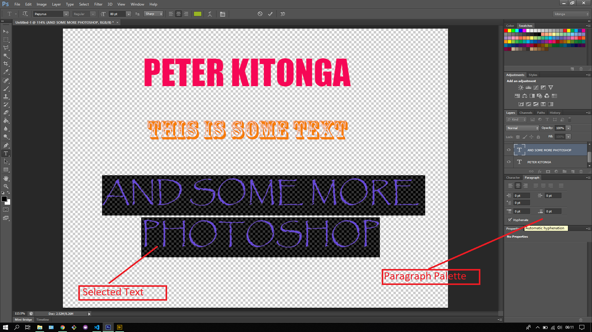

## About Lesson 22

### Brief
In this lesson, I learnt about using the Character and Paragraph palletes. Here I would tweak the settings of the selected text either by changing settings of each character in the text or the the text as a whole.

### Illustration
Here I would change the settings of each character or word by manipulating settings on leading, font size, kerning, tracking, scaling, color and baseline shift.

Here I would change the alignment and indentation of the text as a whole using the Paragraph palette.

### Online Course
Visit [IACT](https://iact.ie) for the course