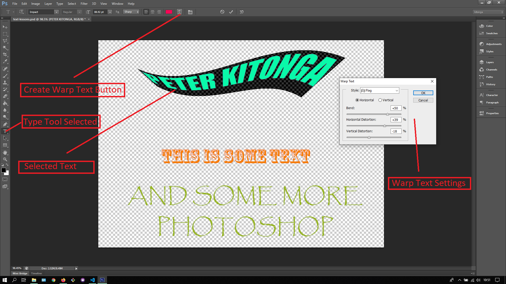

## About Lesson 23

### Brief
In this lesson, I learnt about Warping text while under the Horizontal Type Tool. Here we first select the desired layer of text to be edited then highlight the text using the Type Tool for the 'Create Warp Text' button to be available in the options bar.

### Illustration
Here I would change the settings of the Warp Text window. This would in turn apply the selected style to the selected text as illustrated below.

### Online Course
Visit [IACT](https://iact.ie) for the course