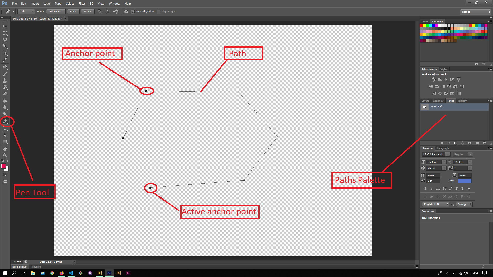
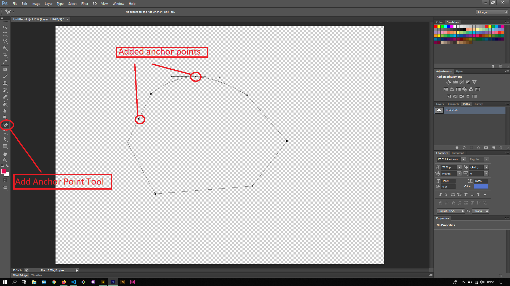
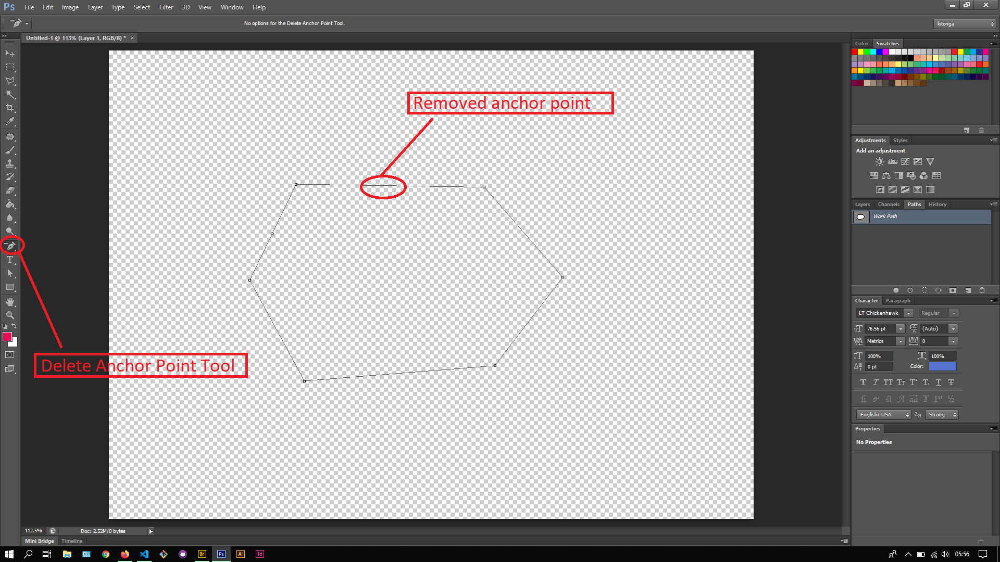
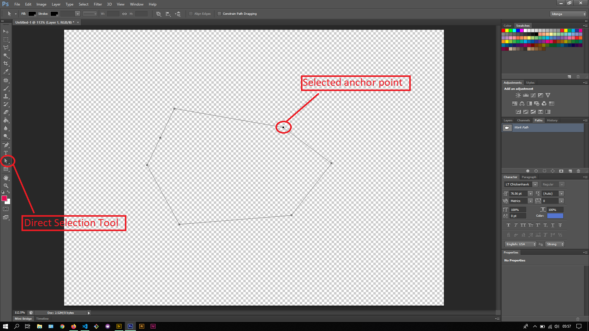

## About Lesson 24

### Brief
In this lesson, I learnt about using the Pen Tools which are used to create anchor points to create a path. There are 5 types of Pen Tools as follows:
- Pen Tool
- Freeform Pen Tool
- Add Anchor Point Tool
- Delete Anchor Point Tool
- Convert Point Tool

### Illustrations
Here using the Pen Tool, I would plot anchor points to create a path that would in the end be a shape. This shape is also visible in the Paths Palette

Here using the Add Anchor Point Tool, I would add anchor points which I can select and move around to create curves

Here using the Delete Anchor Point Tool, I would click on the anchor point to be removed which will inturn delete it

Here I would use the Path Selection Tool to select the whole path created and perform changes to the whole path

Here I would use the Direct Selection Tool to select specific anchor points and move them around to the desired location

### Online Course
Visit [IACT](https://iact.ie) for the course