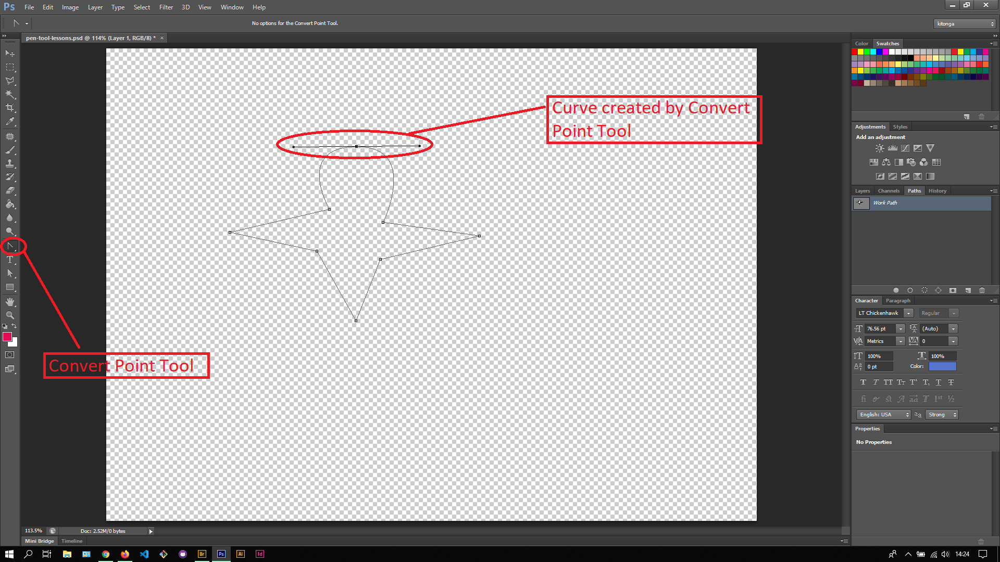
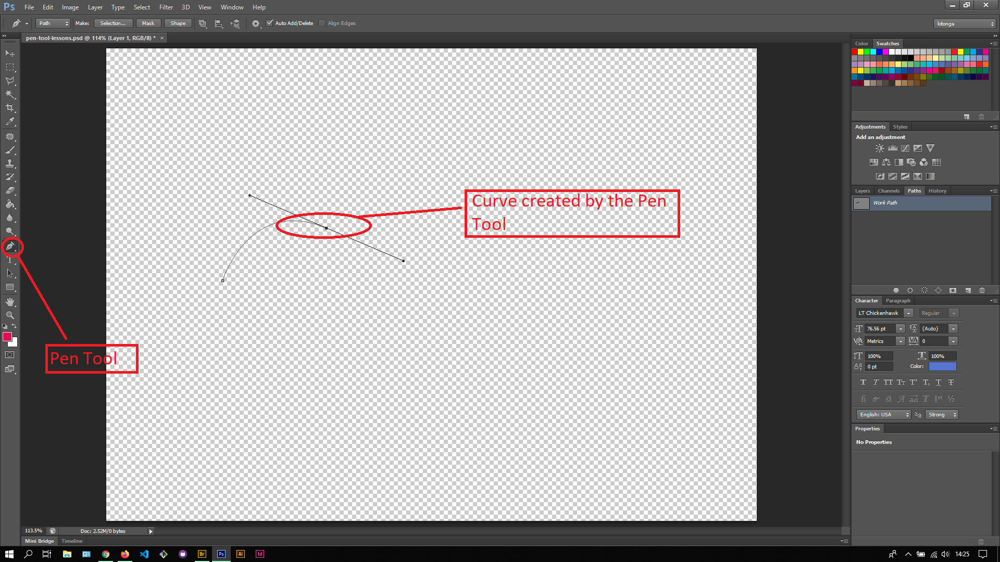

## About Lesson 25

### Brief
In this lesson, I learnt about using the Pen Tools to create curves from the plotter paths and anchor points. I used the Pen Tool and Convert Point Tool to get the same result but with different actions.

### Illustrations
Here using the Pen Tool, I would plot anchor points to create a shape from the paths and anchor points. Then I would use the Convert Point Tool to click and drag on a specific anchor point to the left or right, creating the curve as illustrated

Here using the Pen Tool, I would add an anchor point then when clicking on the position for the next anchor point, I would drag to the right or left to create a curve

### Online Course
Visit [IACT](https://iact.ie) for the course