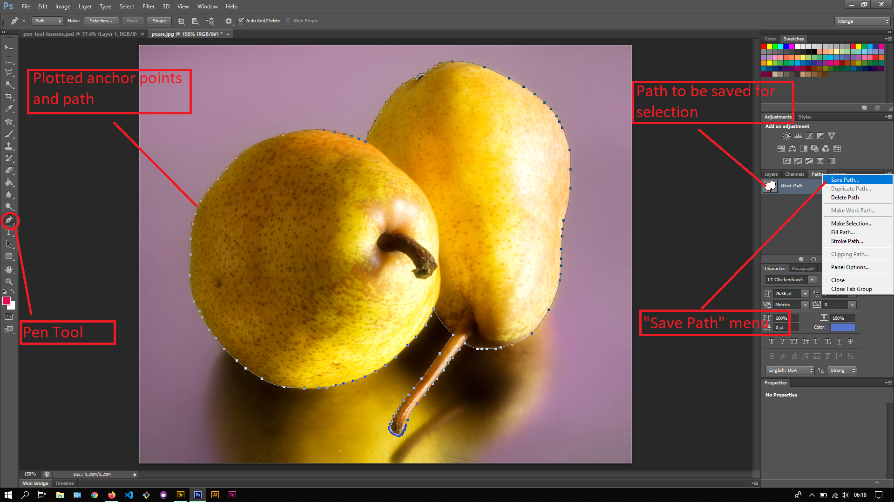

## About Lesson 26

### Brief
In this lesson, I learnt about using the Pen Tools to create a selection from an image by plotting a path around the section we want to select from the image. Here I also created curves around the section using the pen tool by clicking and dragging when plotting an anchor point. To remove the handle simply hold down on the Alt key and click on the anchor point that you have used to create a curve. This will help reduce unnecessary curves as you continue plotting the next anchor points.

### Illustrations
Here using the Pen Tool, I would plot the path and save it in the Paths Palette as illustrated.

### Online Course
Visit [IACT](https://iact.ie) for the course