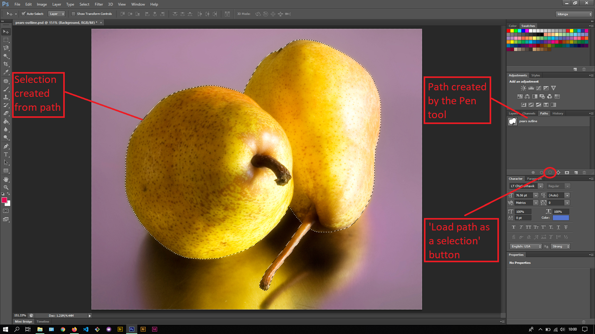
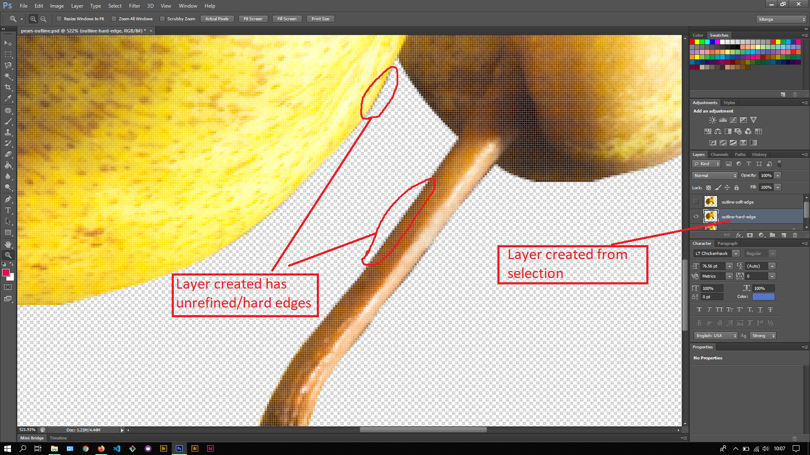
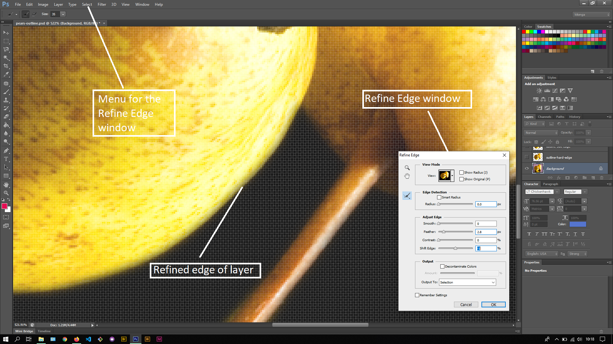
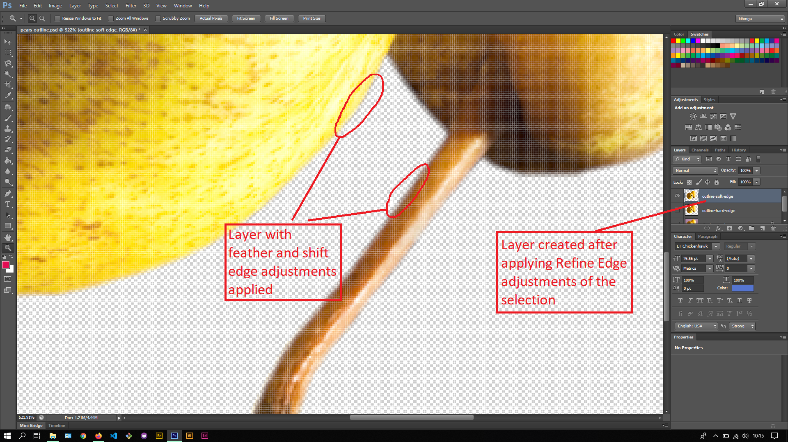

## About Lesson 27

### Brief
In this lesson, I learnt about creating selections from the work path in the Paths Palette. Here, I was also able to apply Refine Edge adjustments to the selection before creating a layer via copy(ctrl + J)

### Illustrations
Here, using the 'Load path as a selection' button under the Paths Palette, I was able to create a selection from the path and in turn create a layer.

The layer created had very unrefined edges where the selection was a little shaky.

To soften the edges of the selection, I would navigate to the Refine Edge window via Select > Refine Edge menu. This window is responsible for applying adjustments that soften up the edges as illustrated below where I added a feather and shifted the edges slightly.

After applying the adjustments, I created a layer via copy(ctrl + J).

### Online Course
Visit [IACT](https://iact.ie) for the course