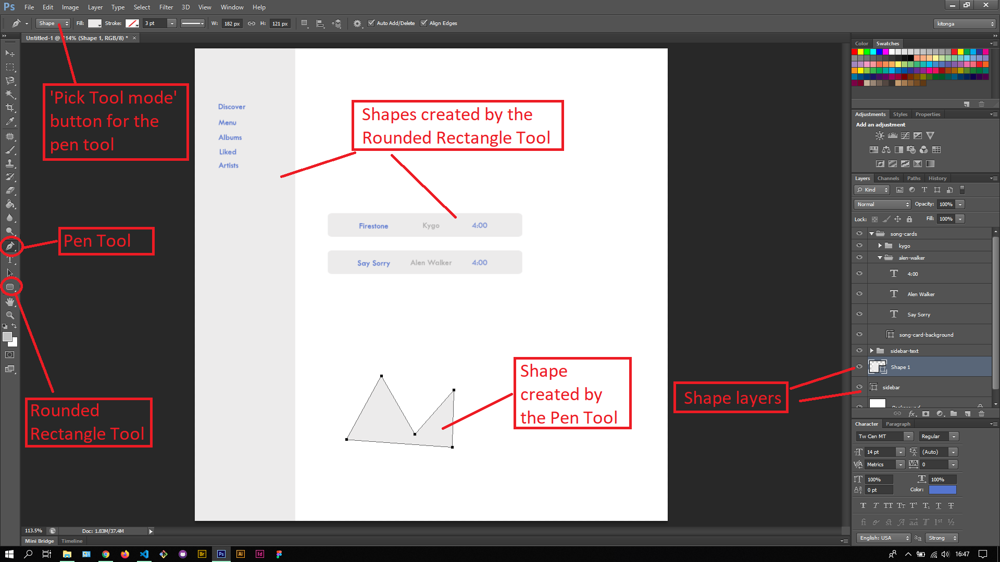
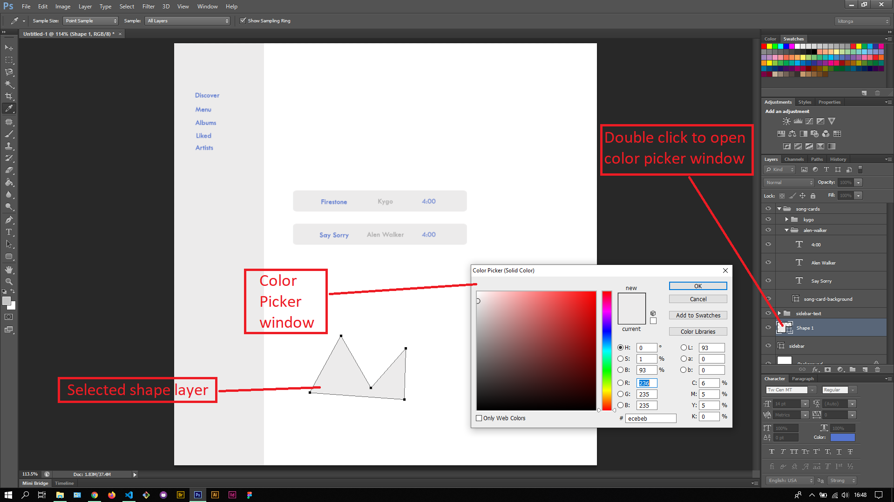

## About Lesson 28

### Brief
In this lesson, I learnt about creating shapes using the Pen Tool and Rectangular Tool. 

### Illustrations
Here I was able to create shape layers by choosing the shapes option in the options bar while the Pen Tool is active. This had inturn helped me to create a shape with a background color.

Here I double clicked on the layer icon for the shape layer created by the Pen Tool which opened the Color Picker window. This window allowed me to pick a different background color for the shape layer.

### Online Course
Visit [IACT](https://iact.ie) for the course