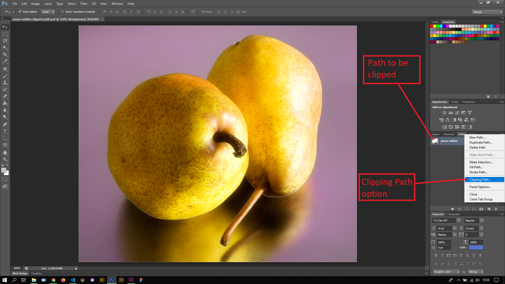
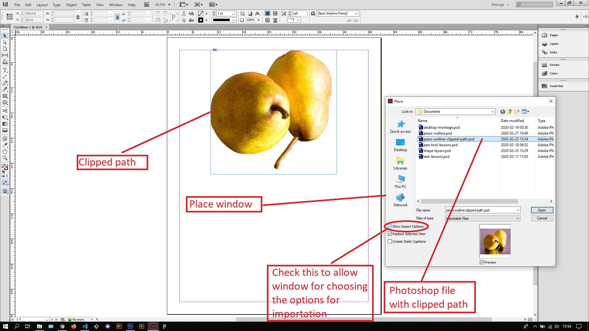

## About Lesson 29

### Brief
In this lesson, I learnt about clipping paths created under the Paths Palette with the Pen Tool. The clipped path can be loaded onto InDesign to be used for print graphics. 

### Illustrations
Here I created the clipped path using the 'Clipping Path' option in the dropdown on the Paths Palette. After the path was clipped, I saved the document into a PSD.

Here I imported the clipped path from the PSD file in InDesign using the Place window(File > Place). Here I checked the 'Show Import Options' checkbox to allow selection of importation options in the next window that opens.

### Online Course
Visit [IACT](https://iact.ie) for the course