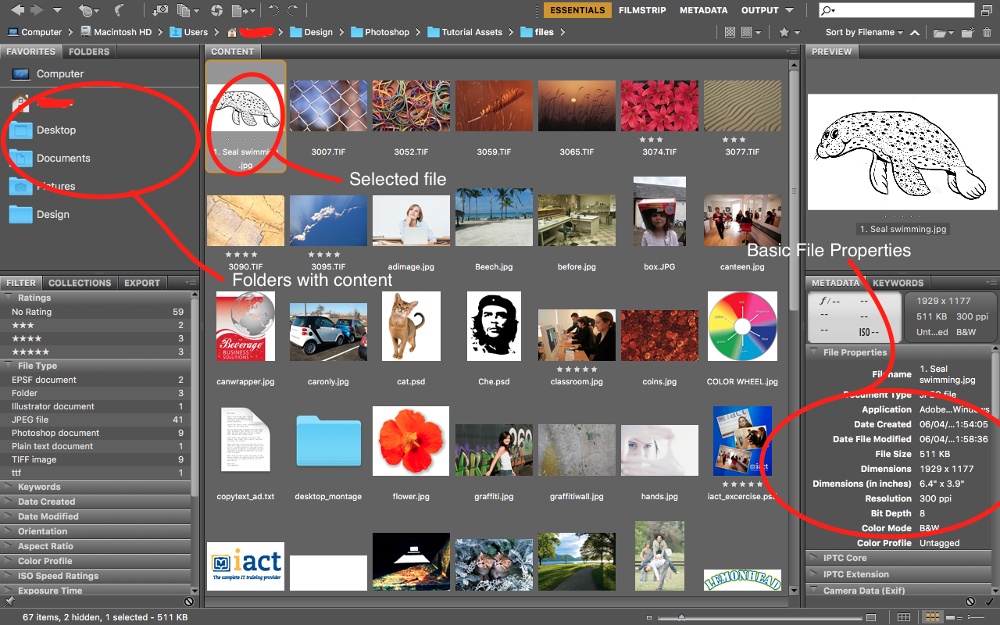

## About Lesson 3

### Brief
In this lesson, I learnt about working with Bridge where the application would only list files contained in folders.
The layout consists of:
- The left pane where one can see tabs listing folders and some tabs showing filter, collections and export options.
- The middle pane where all the content of a selected folder are listed.
- The right pane where we can see a preview of the image selected as well as some metadata containing file properties e.t.c.

### Illustration

### Online Course
Visit [IACT](https://iact.ie) for the course
