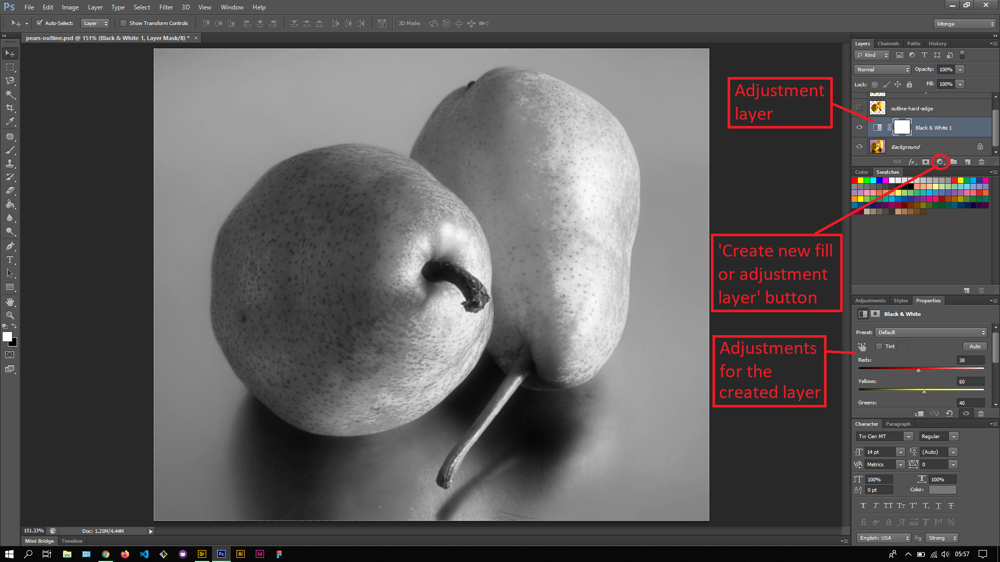

## About Lesson 30

### Brief
In this lesson, I learnt about adding adjustment layers. We add adjustment layers to images when we don't want to permanently apply adjustments under the menu Image > Adjustments. This is advantageous because we can work with the layer and apply the various hue/saturation, brightness/contrast, gradients e.t.c without permanently affecting the image.

### Illustrations
Here I created an adjustment layer by clicking on the 'create new fill or adjustment layer' button and selecting 'Black & White' adjustment from the dropdown menu. This inturn opened up the Properties Palette with sliders for adjusting the color channels for the created adjustment layer.

### Online Course
Visit [IACT](https://iact.ie) for the course