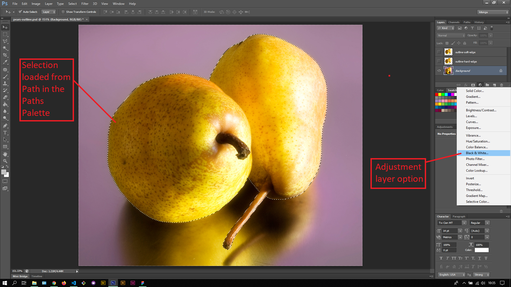
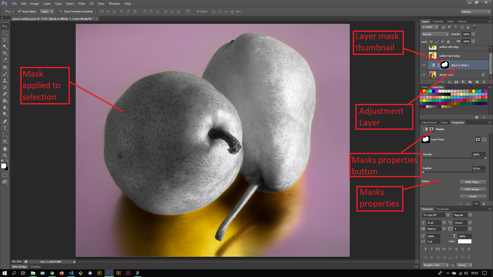
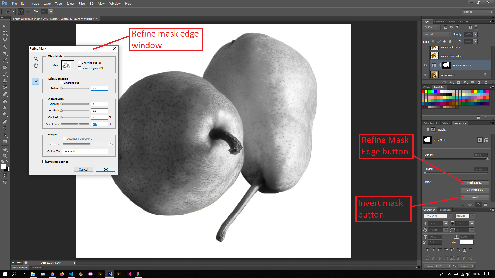

## About Lesson 31

### Brief
In this lesson, I learnt about adding adjustment layers with a mask. Here I created an adjustment layer from a loaded selection from the Paths Palette. Once the adjustment layer was created I was able to apply masks and adjust the properties of the masks in the Properties Palette.

### Illustrations
Here I created an adjustment layer(Black & White) from the loaded selection in the Paths Palette.

In this illustration, I switched from the Layer thumbnail to the Layer mask thumbnail which allowed me to apply adjustments to the mask. Under the Properties palette, I switched to the Masks properties tab and adjust the mask properties.

Here, I learned how to refine the edges of the mask using the Refine Mask window as illustrated. I was also able to invert the mask applied between the pears and the background of the pears using the Invert button.

### Online Course
Visit [IACT](https://iact.ie) for the course