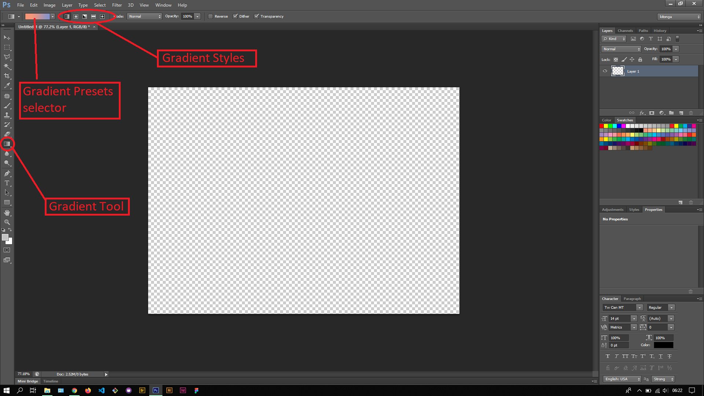
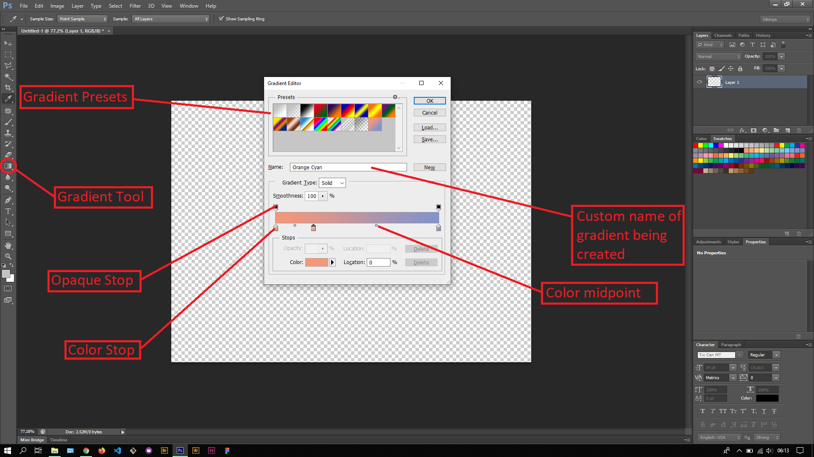

## About Lesson 32

### Brief
In this lesson, I was introduced to the Gradient Tool and was able to create new Gradient presets from the options bar.

### Illustrations

In this illustration, I clicked on the gradient presets selector and was presented with a Gradients Editor where I created my new custom preset. To add colors for our presets we click on the desired color stop and can use the Swatches palette to select a color for the stop. The Color midpoint is where the colors for the color stops intersect and can be adjusted as desired. The Opaque stop defines the opaqueness of the color in the position of the Opaque Stop.

### Online Course
Visit [IACT](https://iact.ie) for the course