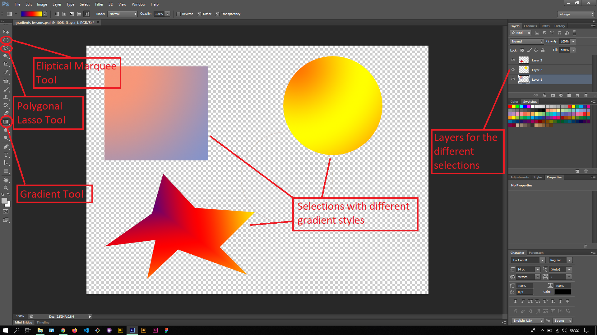

## About Lesson 33

### Brief
In this lesson, I learnt about applying gradient presets to selections while using different gradient styles from the options bar.

### Illustrations

In this illustration, I created multiple layers and added selections to the them using the various selection tools such as the Eliptical Marquee, Rectangular Marquee and Polygonal Lasso. I then applied gradients to each selection with different gradient styles.

### Online Course
Visit [IACT](https://iact.ie) for the course