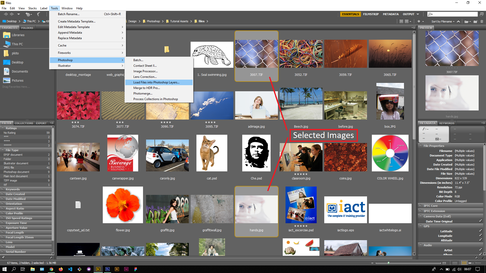
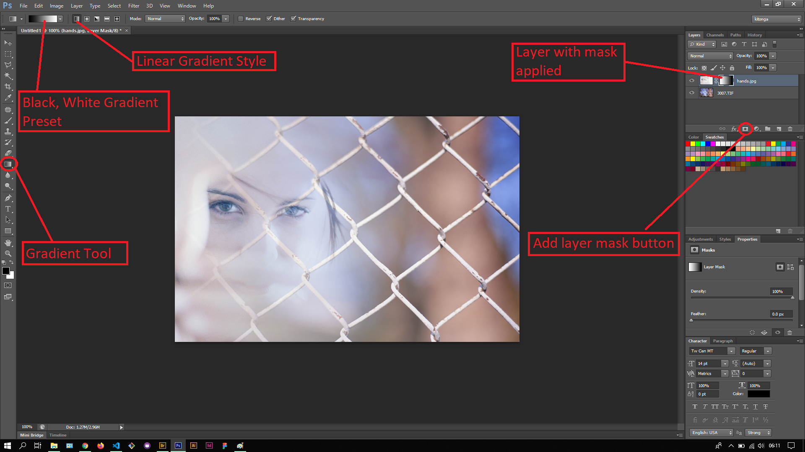

## About Lesson 34

### Brief
In this lesson, I learnt about applying a gradient to a layer mask to blend two images together.

### Illustrations

In this illustration, I first selected the two images to work with and loaded them on Photoshop as layers.

Here I added a layer mask using the 'Add layer mask' button to the top layer and clicked on the layer mask thumbnail. Using the gradient tool, I selected the Black, White gradient preset and applied a linear gradient. The reason for using the Black, White preset is that in masks, black usually hides and white shows which created the blending effect on the images as illustrated below.

### Online Course
Visit [IACT](https://iact.ie) for the course