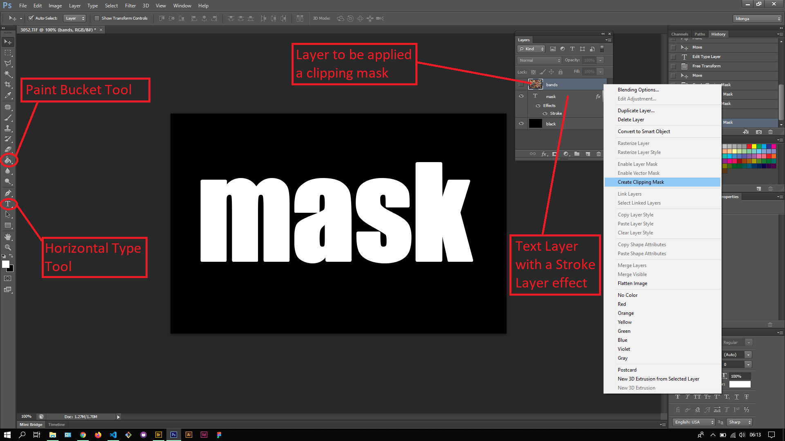
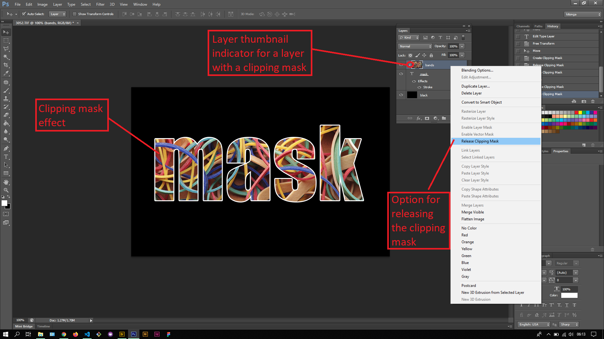

## About Lesson 35

### Brief
In this lesson, I learnt about creating a clipping mask from a layer to create a clipping mask effect. I was able to create a blend between three layers to create an awesome effect to a text layer.

### Illustrations

In this illustration, I first created a layer and filled it with black color using the Paint Bucket tool and moved the layer to be the bottom most layer. Then I added text using the Horizontal Type tool and added a white stroke layer effect. I then selected the layer I wanted to add a clipping mask and right clicked on it to get the option 'create clipping mask'.

Here I added created a clipping mask to blend the bands layer with the text layer as illustrated. The option of removing the clipping mask is demonstrated as below.

### Online Course
Visit [IACT](https://iact.ie) for the course