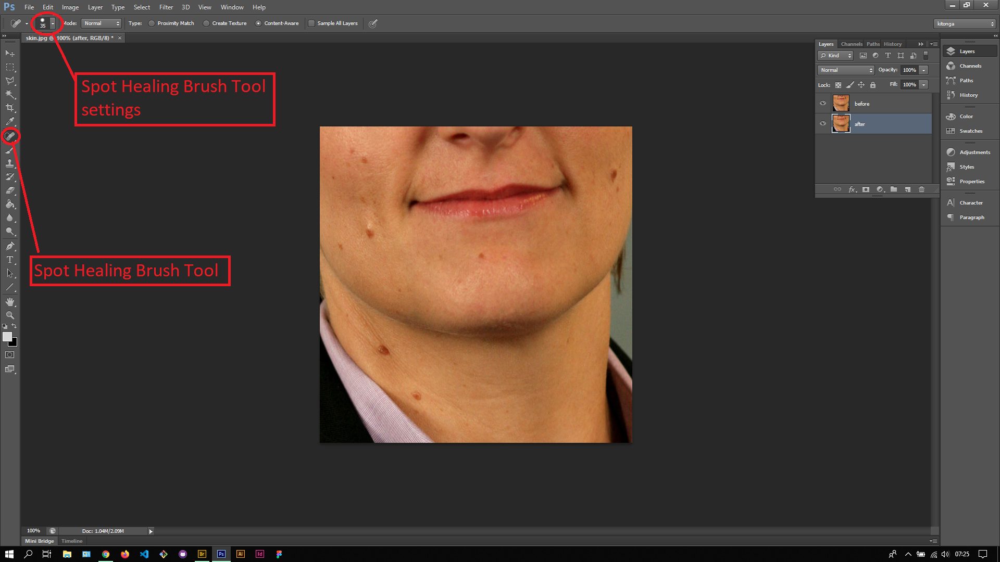
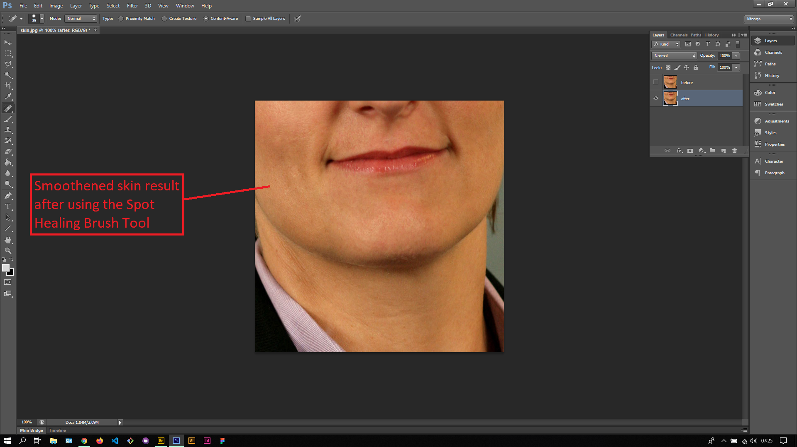

## About Lesson 36

### Brief
In this lesson, I was introduced to one of the repair tools, the Spot Healing Brush tool. Repair tools in Photoshop include:
- Spot Healing Brush Tool
- Healing Brush Tool
- Patch Tool
- Content-Aware Move Tool
- Red Eye Tool
- Clone Stamp Tool

### Illustrations

In this illustration, I first duplicated the first layer and renamed them as illustrated. I also adjusted the setting/properties of the Spot Healing Brush Tool to the desired size and hardness.

Here, by clicking on each mould and spot, I was able to smoothen out the subject's skin using the tool. The tool uses the Content-Aware setting on the options bar to fill the spots with pixels that match the ones in the surrounding area. 

### Online Course
Visit [IACT](https://iact.ie) for the course