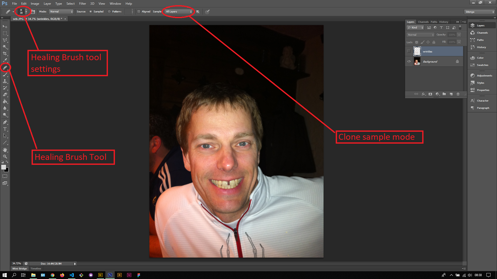

## About Lesson 37

### Brief
In this lesson, I learnt about using the Healing Brush tool which is similar to the Spot Healing Brush tool but with a manual blending mode. In this tool, we are expected to select the area we want to match with by holding down on the Alt key and clicking on the area to be cloned. After that we now click on the section to be smoothened.

### Illustrations

In this illustration, I first created a layer called wrinkles that would house the blending/repair effects. I chose the 'All layer' clone sample mode so as to get the effect on the wrinkles layer. I also adjusted the hardness and size of the brush to the desired settings.

Here, I cloned the areas around the wrinkles so as to smoothen them out and have a blended effect. I was able to see the differences of the result and original image by toggling on & off the wrinkles layer.

### Online Course
Visit [IACT](https://iact.ie) for the course