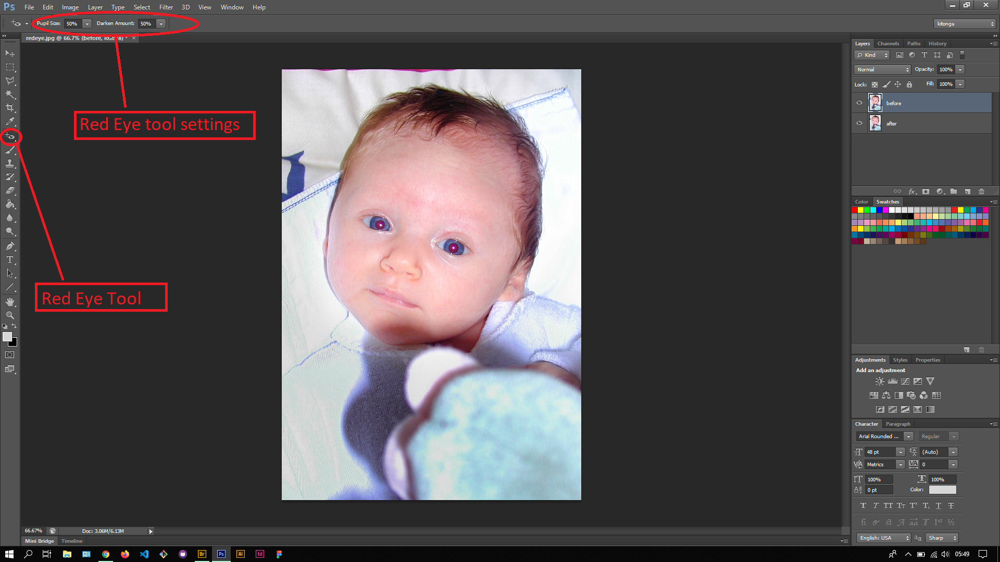
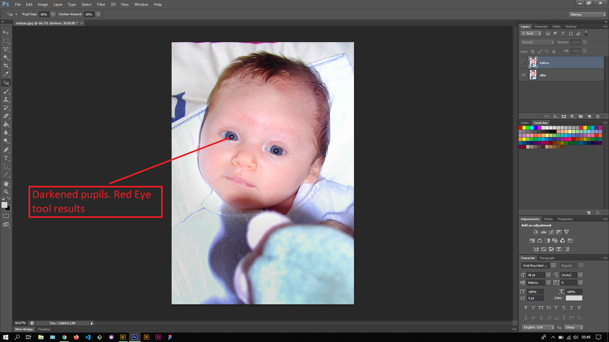

## About Lesson 38

### Brief
In this lesson, I learnt about using another repair tool called the Red Eye tool. Red eye occurs when a photo is taken of us with a flash and the light bounces back from our eyes exposing blood. With this tool we can darken the pupils so as to remove the red eye effect.

### Illustrations

In this illustration, I first created a layer called 'after' to house the results. To remove the red eye I simply clicked into the pupil area and the Red Eye tool filled it with black pixels.

### Online Course
Visit [IACT](https://iact.ie) for the course