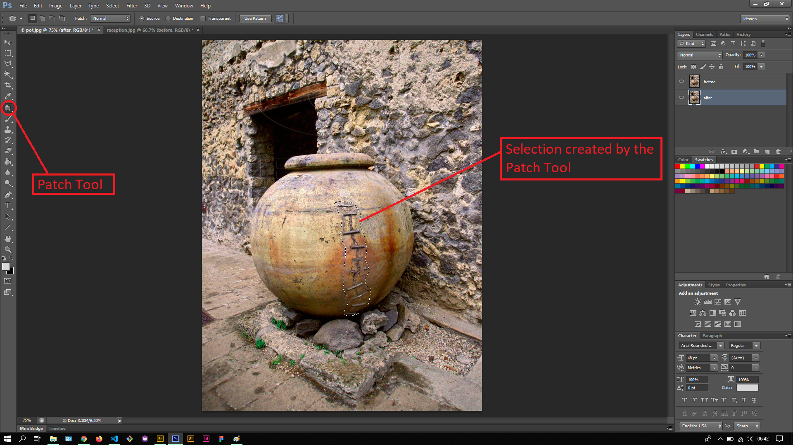
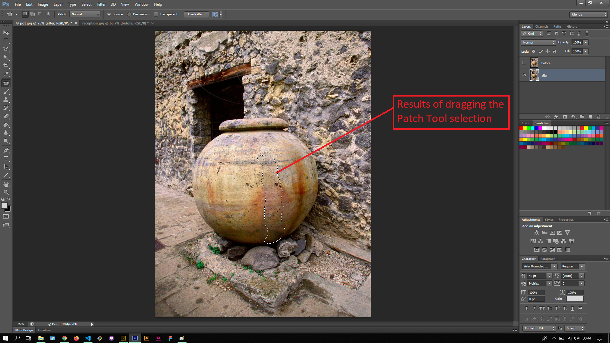
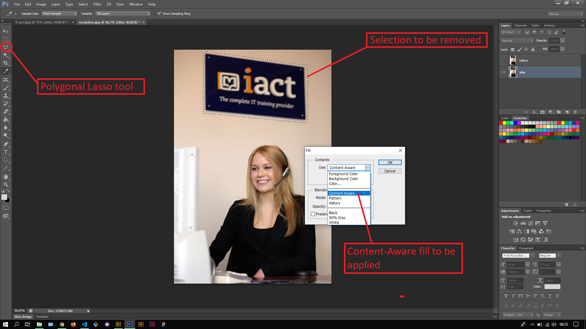
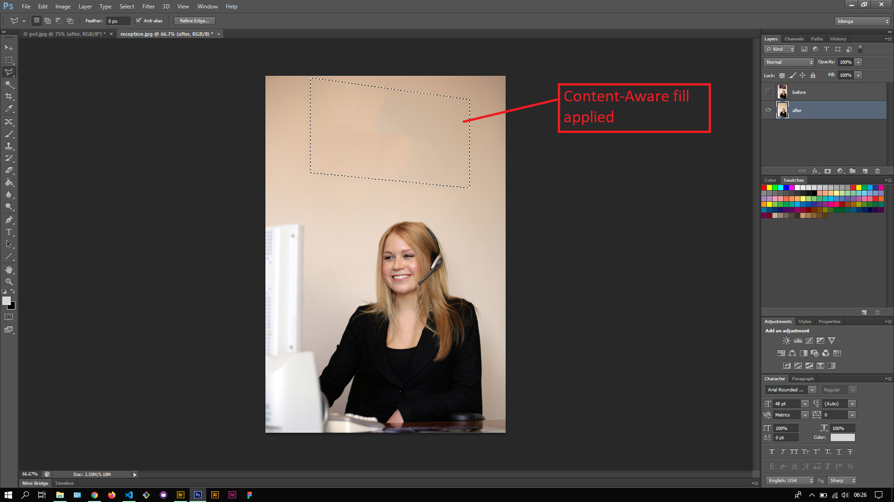

## About Lesson 39

### Brief
In this lesson, I learnt about using the Patch tool where we would draw around the selection we want to remove using the patch tool and click & drag the selection to another section of the image. I also learnt about using the content aware fill to remove a section of the image from a selection created by any of the selection tools.

### Illustrations

In this illustration, I first created a layer called 'after' to house the results. Using the patch tool I drew around the stitch of the pot and clicked & dragged the selection to another section of the pot so as to create a blend.

Here, I first created a selection using the polygonal lasso tool and opened the fill window under the Edit > Fill menu. In this window I chose the 'Content-Aware' fill option and applied it.

### Online Course
Visit [IACT](https://iact.ie) for the course