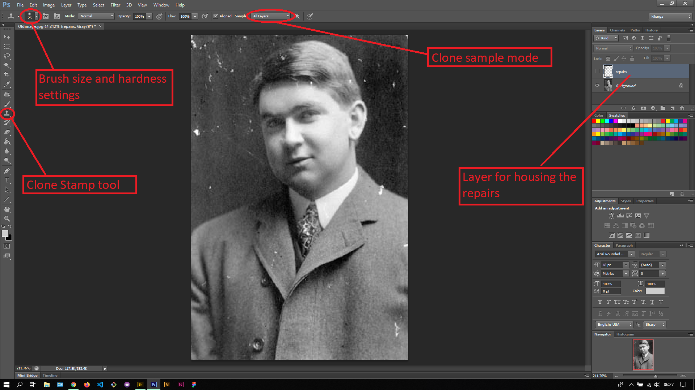
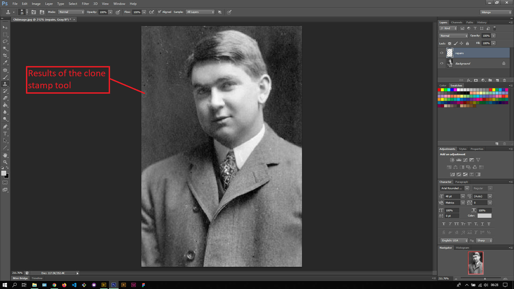

## About Lesson 40

### Brief
In this lesson, I learnt about using the Clone Stamp tool which works similar to the Healing Brush. When used together with a selection tool like the Lasso tool, it will only apply the blend to the section inside the selection created.

### Illustrations

In this illustration, I created a layer called 'repairs' to house the results. Using the clone stamp tool, I was first holding down the Alt key and clicking on a suitable clone section and clicking on the area to blend.

### Online Course
Visit [IACT](https://iact.ie) for the course