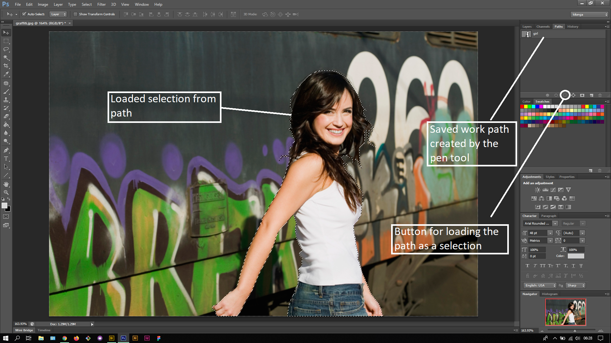
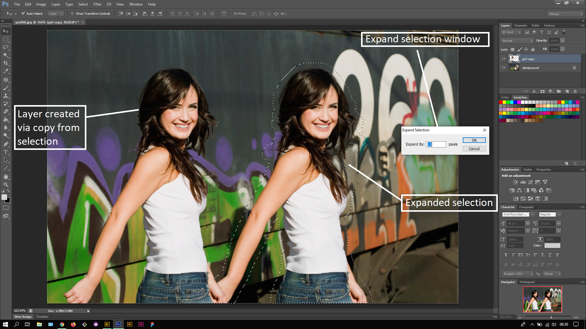
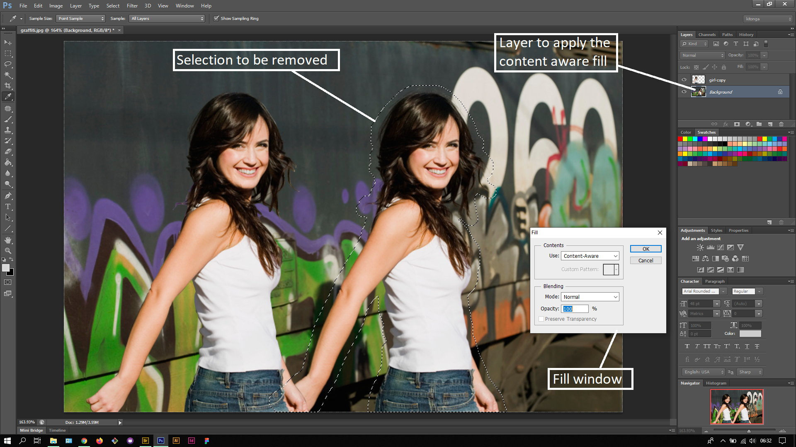
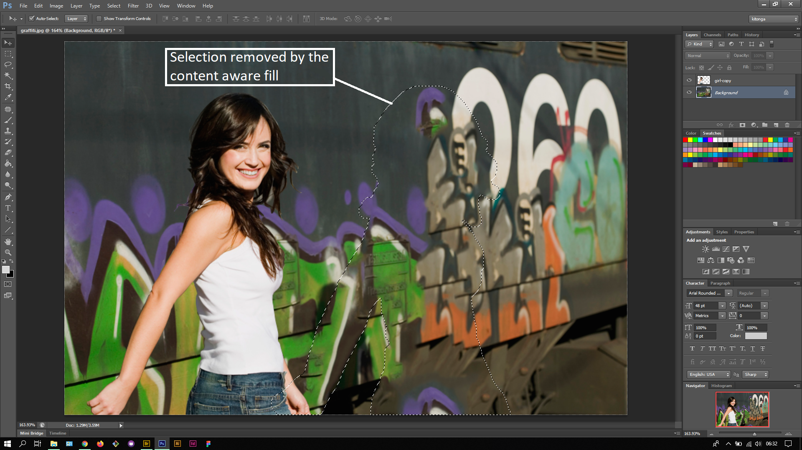

## About Lesson 41

### Brief
In this lesson, I further learnt about using the Content-Aware Fill which is applied via the Fill window under the menu Edit > Fill. This fill creates a blend to the image with the loaded selection on the image.

### Illustrations

In this illustration, I used the Pen tool to create a work path around the girl in the image.

Here, I used the saved work path to create a selection and made a layer via copy from it. I then nudged the layer to the left of the image while holding down on the Shift key and pressing the left arrow key. I then loaded the path as a selection again and expanded the selection via the menu Select > Modify > Expand. I did this so as to make sure all missed parts of the girl are selected.

Here, I applied the content aware fill to the expanded selection and was able to get the result in the illustration below.

### Online Course
Visit [IACT](https://iact.ie) for the course