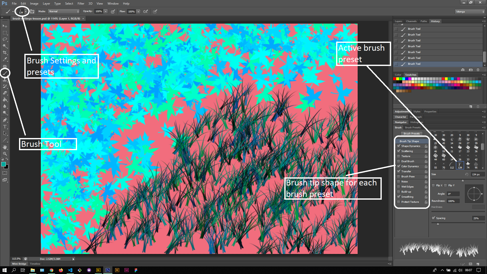

## About Lesson 42

### Brief
In this lesson, I learnt about the brush tool and various presets available on photoshop. I learnt about how to change their settings in terms of hardness, size and brush tip shape.

### Illustrations

In this illustration, I used different brush presets and selected different foreground colors from the swatches palette.

### Online Course
Visit [IACT](https://iact.ie) for the course