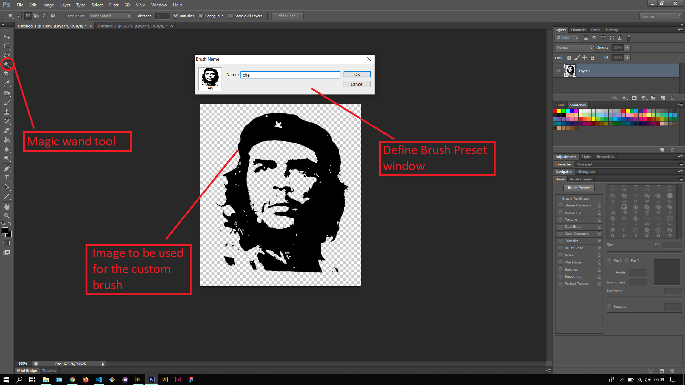
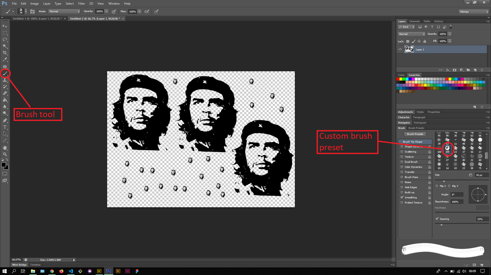

## About Lesson 43

### Brief
In this lesson, I learnt about creating a custom brush preset from an image. I first opened an image and selected the wanted sections of the image and using it to create the brush preset.

### Illustrations

In this illustration, I used first used the Magic wand tool to select the black pixels of the image and then used the menu Select > Similar to select all black pixels that had not been selected. I then inversed the selection via menu Select > Inverse and pressed on the Backspace key to remove the selection. After that I created the brush preset via the menu Edit > Define Brush Preset. This opens a window for entering the custom name of the preset.

Here, I selected the custom brush preset from the Brush palette and used it on a new photoshop document.

### Online Course
Visit [IACT](https://iact.ie) for the course