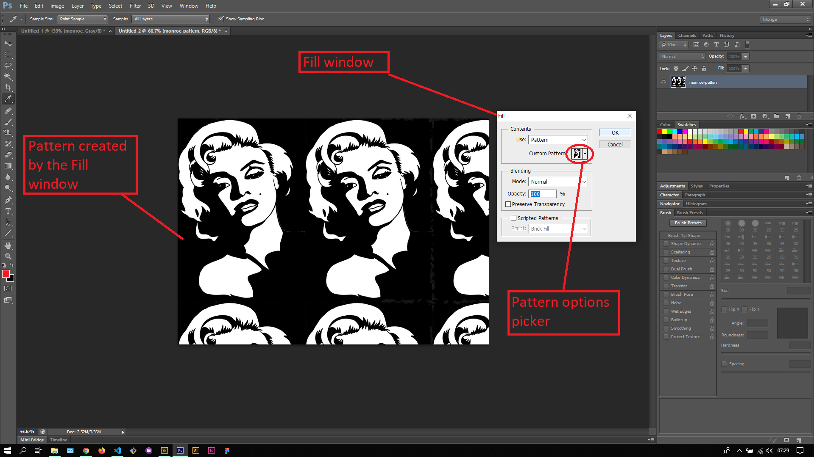

## About Lesson 44

### Brief
In this lesson, I created a custom brush preset just like in the previous lesson and also learnt about creating a pattern.

### Illustrations

In this illustration, I first created a new document from an image then used the image to define a brush preset (Edit > Define Brush Preset) and a pattern (Edit > Define Pattern). For patterns, we are expected to change the image size to the desired size (Image > Image Size) before defining a pattern since we cannot resize patterns like brush presets.

Here, I selected the custom brush preset from the Brush palette and used it on a new photoshop document. I also used the Pattern Stamp tool and selected the pattern created in the illustration above to create a pattern.

The above effect by the Pattern Stamp tool can also be done using the Fill window as illustrated below.

### Online Course
Visit [IACT](https://iact.ie) for the course