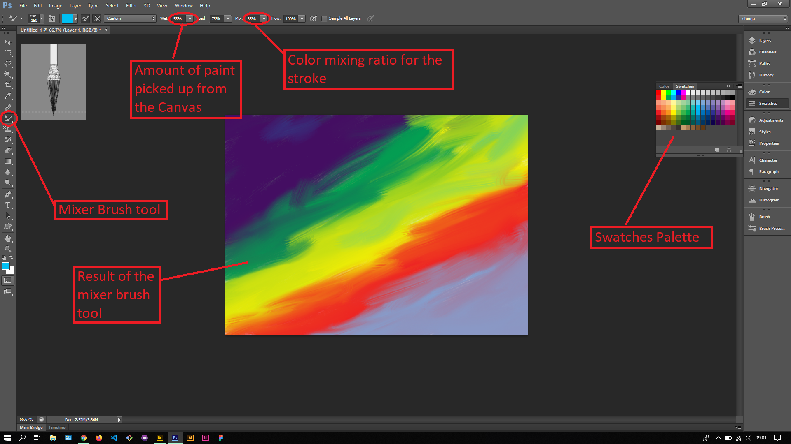

## About Lesson 44

### Brief
In this lesson, I learnt about using the mixer brush tool to create realistic looking brush strokes. Using this tool I could adjust the level of wetness of the brush and mixing ratio for the stroke.

### Illustrations

In this illustration, I first created a new document to serve as the Canvas. Using the Mixer brush tool I would brush onto the canvas after selecting a color from the Swatches Palette. I would adjust the wetness of the brush and mixing ratio to create the blending effect as illustrated.

### Online Course
Visit [IACT](https://iact.ie) for the course