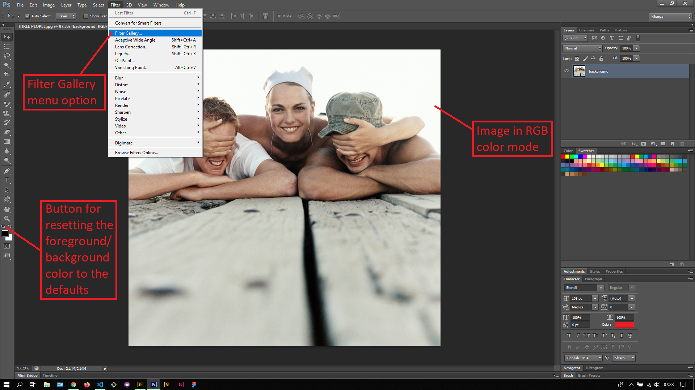
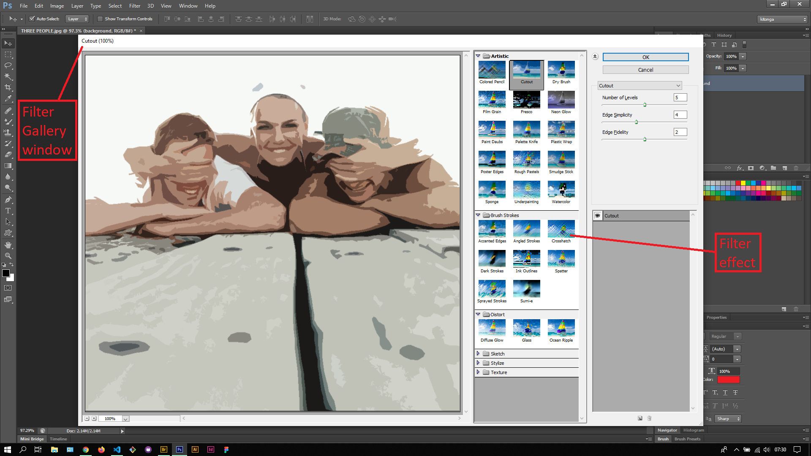

## About Lesson 46

### Brief
In this lesson, I learnt about using the Filter gallery to apply various filter effects to an image in RGB mode. It is important to note that all filters in Photoshop work best under RGB mode and will require you to change the image mode to RGB whenever you are working with filters. The image mode is changed via menu `Image > Mode > RGB Color`

### Illustrations

In this illustration, I first reset the foreground/background color to the defaults so as to not interfere with the filter effects. I also made sure the image was in RGB Color mode. I accessed the Filter Gallery window via menu `Filter > Filter Gallery`. Here I would select an effect and adjust its settings to my liking.

### Online Course
Visit [IACT](https://iact.ie) for the course