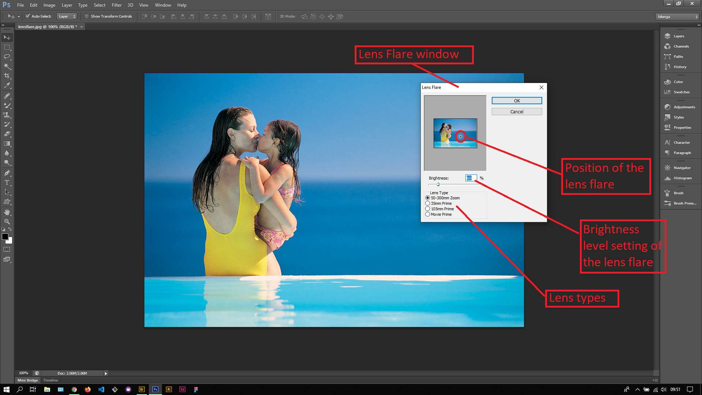
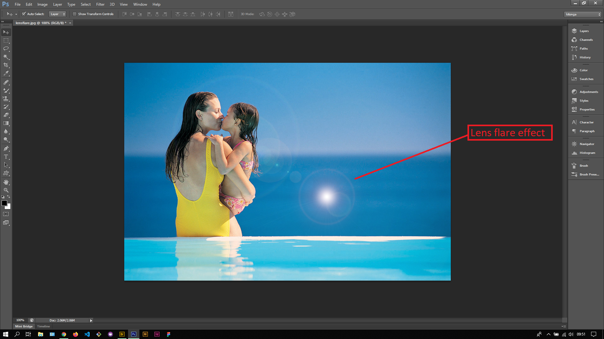

## About Lesson 47

### Brief
In this lesson, I learnt about lighting effects in Photoshop which can be accessed via menu `Filter > Render > Lighting Effects` & `Filter > Render > Lens Flare`. I briefly played around with the lighting effects and later applied a lens flare as illustrated.

### Illustrations

In this illustration, I applied a lens flare filter via the menu `Filter > Render > Lens Flare` to create the lighting effect as illustrated. This type of filter is usually applied to TV graphics and adverts where the flare is animated.

### Online Course
Visit [IACT](https://iact.ie) for the course