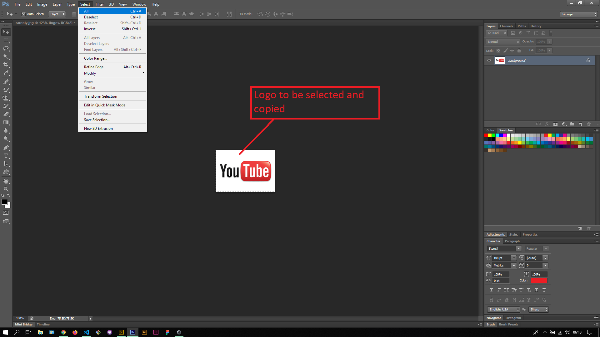
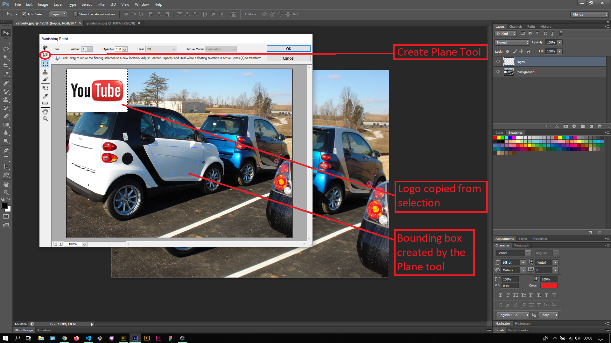
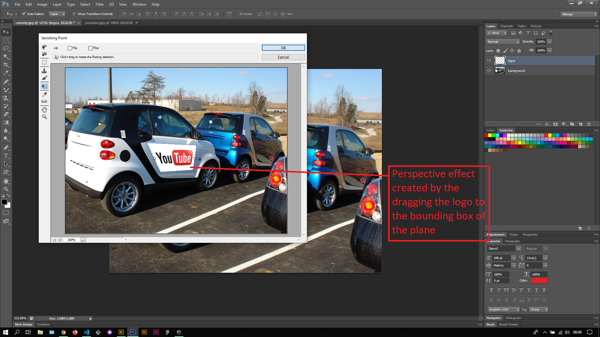
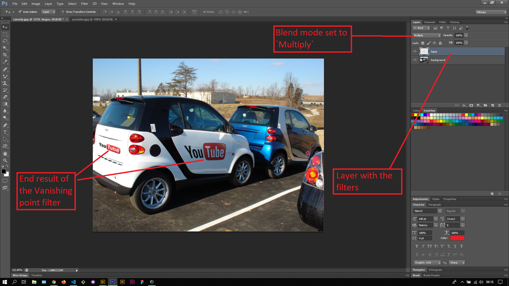

## About Lesson 48

### Brief
In this lesson, I learnt about the Vanishing point filter which is accessed via the menu `Filter > Vanishing Point`.

### Illustrations

In this illustration, I selected the logo I wanted to use in the image and copied it via keyboard shortcuts `Ctrl + C`

Here I first created a layer to house the filters and selected it so as to make sure the filters are applied to it. I then opened the Vanishing point window via menu `Filter > Vanishing Point` where I used the Plane Tool to draw a bounding box that would house the logo.

Here, I resized the logo using Transformations (`Ctrl + T`) and dragged it to the bounding box which created a perspective effect to the logo.

After logos were placed, I applied the `Multiply` blending mode to the layer to remove the white backgrounds of the logos and to created a blending effect to the main image.

### Online Course
Visit [IACT](https://iact.ie) for the course