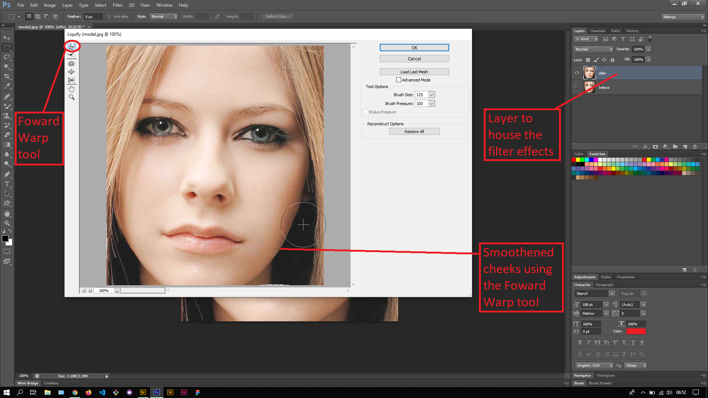
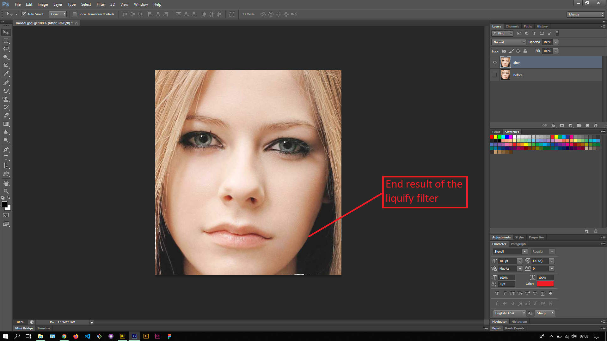

## About Lesson 49

### Brief
In this lesson, I learnt about using the Liquify filter which is accessed via the menu `Filter > Liquify`.

### Illustrations

In this illustration, I first created a duplicate layer of the original image. I then opened the Liquify window via `Filter > Liquify`. In this window I got to learn about the vairous tools available for the filter and focused on the Foward Warp tool. This tool can be used to push in/out edges of an image like as illustrated. Here I used the tool to push in and smoothen the cheeks of the model's photo.

The end result is as illustrated below. The `After` layer houses the filter effects.

### Online Course
Visit [IACT](https://iact.ie) for the course