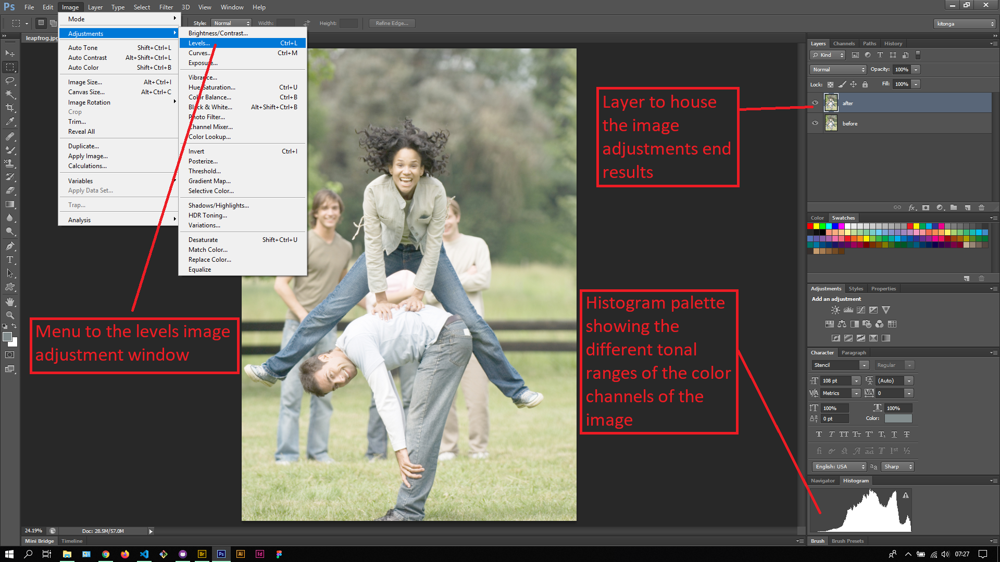
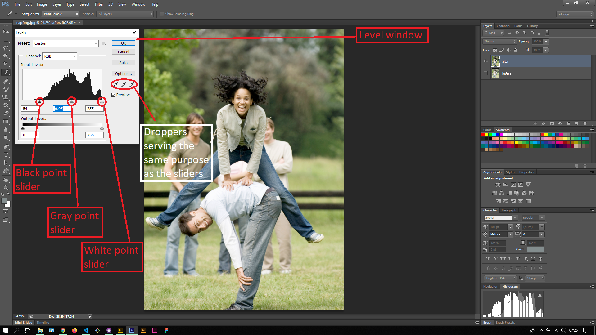
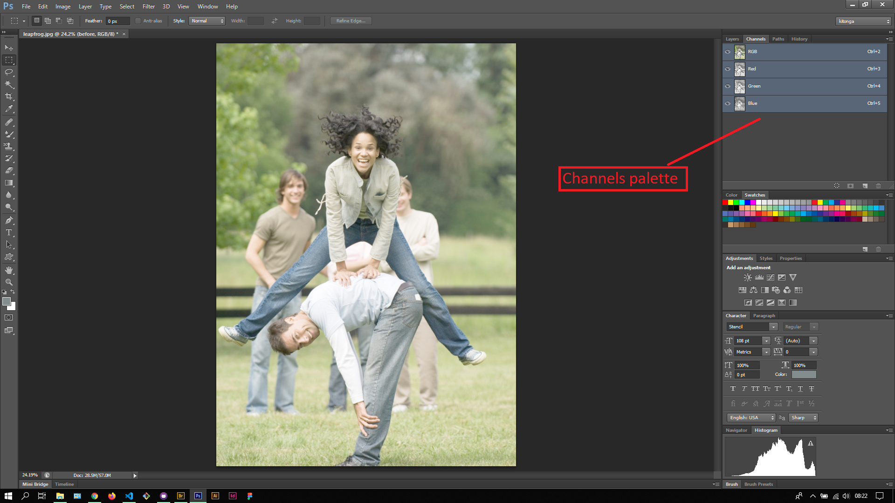

## About Lesson 50

### Brief
In this lesson, I learnt about using the Levels image adjustment to add back color to an image that had washed out color contrast. The Levels image adjustment window is accessed via the menu `Image > Adjustments > Levels`

### Illustrations

In this illustration, I first created a duplicate layer of the original image. I then opened the Levels window.

In this illustration, I was able to adjust the provided sliders to bring back color to the image. I adjusted the position of the black point slider to adjust the darker tones of the image, the gray point slider to adjust the mid tones and the white slider to adjust the light tones of the image. All this can also be achieved by using the droppers.

### Fun fact

The image in this lesson was in RGB color mode. This means that the image has 3 color channels namely: Red, Green and Blue. Each channel has 256 shades of itself which if calculated is 256 Red x 256 Green x 256 Blue and comes to 16,777,216 colors. Amazing!!

### Online Course
Visit [IACT](https://iact.ie) for the course