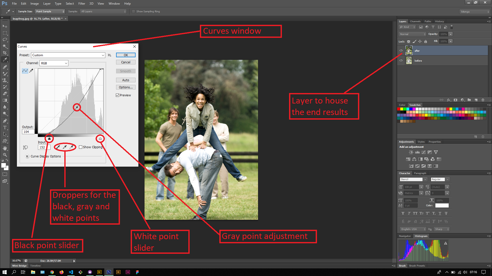
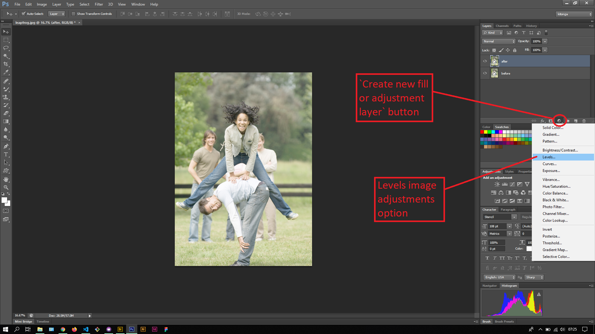
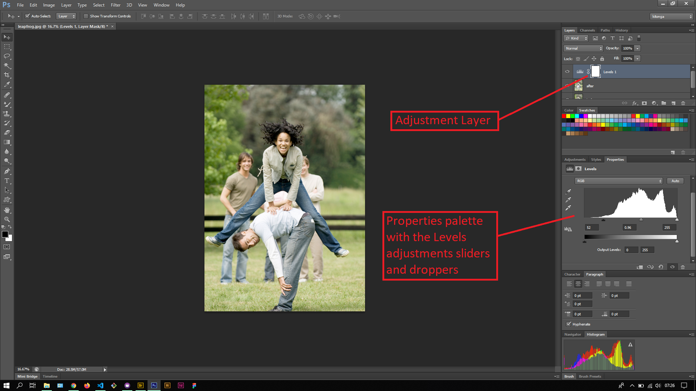

## About Lesson 51

### Brief
In this lesson, I learnt about using the Curves image adjustment accessed via menu `Image > Adjustments > Curves`. The curves image adjustment is similar in purpose as the Levels adjustments but has more customization for the Gray point where one plots points in the line as illustrated below and drags the plot points to the desire position. This adjustment is far more complex to use compared to the Levels adjustments and needs a clear understanding of what one wants to achieve.

### Illustrations

In this illustration, I first created a duplicate layer of the original image. I then opened the Curves window. In this window, I adjusted the position of the Black point and White point. I then plotted a point in the line and pulled it down to adjust the gray/mid tones of the image.

In this illustration, I revisited the adjustments layer lesson and created an adjustment layer. All image adjustment options are also available here and is most preferable to use since one can readjust their effects through the Properties palette.

In the Properties palette I was able to perform the same adjustments as from the Levels window. This gives me mmore flexibility to come back and readjust the  points when not satisfied with the results. Another advantage to the adjustments layer is that one can simply delete or toggle it off if he/she no longer needs it.

### Online Course
Visit [IACT](https://iact.ie) for the course