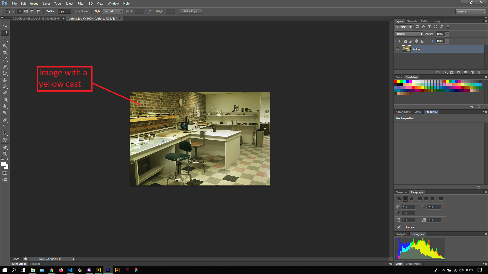

## About Lesson 52

### Brief
In this lesson, I learnt about removing a color cast from an image using image adjustments such as Levels, Hue/Saturation and filters such as the Photo filter. I also briefly learnt about the color wheel and how colors complement each other in the color spectrum.

### Illustrations

In this illustration, I learnt about the complementary opposites of each color. I will research further on this to further gain knowledge in the topic. [Click here](https://blog.hubspot.com/marketing/color-theory-design) to read an article on the topic.

In this illustration, I opened an image with a yellow cast on it where we will adjust the blue channel to get rid of it.

Here, I used the Levels image adjustment where I first selected the blue channel and adjusted the white point to remove the yellow cast.

Here, I used the Hue/Saturation image adjustment where I selected the yellow color channel and desaturated it to remmove the yellow cast.

Here, I use the Photo filter adjustment layer and selected the color filter option. Using the color filter window I selected a blue color filter and increased the density using the slider.

### Online Course
Visit [IACT](https://iact.ie) for the course