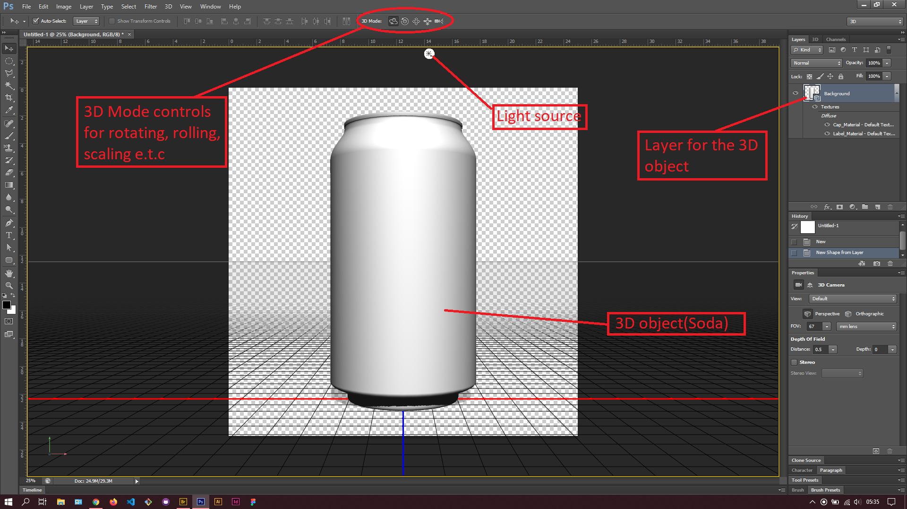
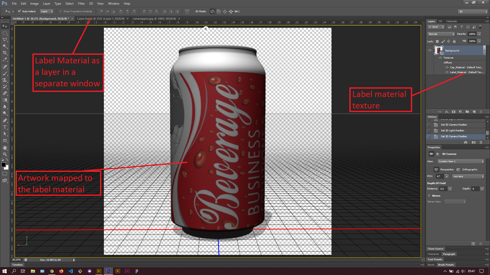
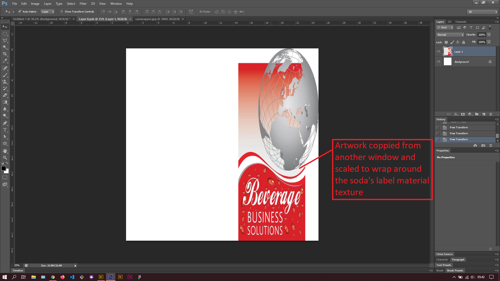

## About Lesson 53

### Brief
In this lesson, I learnt about creating a 3D object from the various photoshop 3D object presets found under menu `3D > New Mesh from Layer > Mesh Preset`.

### Illustrations

In this illustration, I created a 3D object from a Soda preset in photoshop. I got to play around with the various 3D modes on the options bar and adjusted the light source to my liking.

Here, I added artwork to the 3D object by double clicking on the label material which opened in a new window as a layer. This is where I copy-pasted the artwork and scaled it to the height of the label material.

### Online Course
Visit [IACT](https://iact.ie) for the course