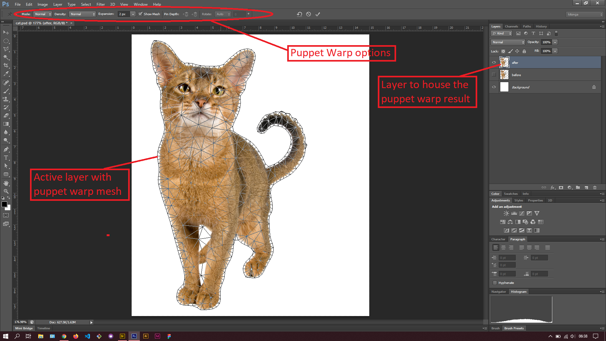

## About Lesson 54

### Brief
In this lesson, I learnt about the puppet warp tool which is used to distort pecific areas of an image. This tool can be accessed via the menu `Edit > Puppet Warp`.

### Illustrations

In this illustration, I first created a duplicate layer of the cat and clicked on the Puppet Warp tool to get the mesh overlay as illustrated.

On the mesh I plotted points that would be used as anchors for moving the head, ears and tail positions.

Once the points were in place I dragged the head, ears and tail to the desired position. This inturn resulted in the cat looking like it has titled it's head.

### Online Course
Visit [IACT](https://iact.ie) for the course